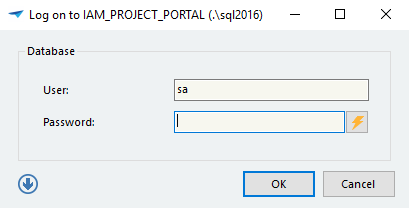

The purpose of the administrator is to provide the user with access to the application. There are a number of important steps to achieve this. For instance, user groups must first be created, to which the users are linked. The rights are always assigned at group level and this will be further described in the coming chapters.

There are different types of administrators with different rights. This is done, so that the IAM can be set up by various people who can each organize matters for their components. The types of administrators that are recognized will be examined in the following paragraph.

## Types of administrator

The Intelligent Application Manager has different kinds of administrators. For example, some administrators may synchronize new project versions and other administrators are responsible for creating user groups and users. There are eight levels defined to set up the rights for each administrator. Which are described in the section below.

In this manual it is assumed that the IAM administrator has the rights on the following roles:

- Application Owner

- Group Administrator

- Group Owner

- User Administrator

- Simulator

This implies that this administrator is not involved with the first four roles, within which among other things the synchronization of new project versions and creating new applications fall. We briefly mention this in this manual to outline a total picture of the possible administrator types.

The above figure comes from the menu component 'Users' under the tab 'Administrators'. The type of administrators are here assigned to a user.

### Head Administrator

This type of administrator has rights on all components within the IAM. This implies that he is responsible for the synchronization of new project versions, but he can also define new roles, applications, groups and users.

### Project Administrator

The Project Administrator may synchronize new projects and create roles. In addition, he can also define Project Owners.

### Project Owner

The Project Owner may administer new roles for his own projects. This implies that he can create, modify and delete roles for the projects for which he is the owner.

### Application Administrator

The Application Administrator may create new applications and link the roles that have been created by the Project Owner or Administrator to groups. These groups must first have been created by the Group Administrator. In addition, he can also define Application Owners.

The following administrator types are available for this IAM administrator:

### Application Owner

The Application Owner can link roles that have been created by the Project Owner or Administrator to groups within the application for which he is the owner. These groups must first have been created by the Group Administrator.

### Group Administrator

The Group Administrator may create new groups and link users to them. These users must first be created by the User Administrator. In addition, he can also define Group Owners.

### Group Owner

The Group Owner may link users to the groups for which he is the owner.

### User Administrator

The User Administrator can create new users.

### Simulator

The simulator is a special function. This function is able to simulate other users.

To check the specified user preferences or to answer questions from a user, the administrator can log in to simulate a specific user. This is done by logging in with the administrator\'s user name and password and then by pressing the button next to the password.

An extra option appears to enter the user name of the user, who must be simulated.

> To simulate users, it is necessary that the pop-up is displayed. When this normally speaking does not occur because a Windows authentication is used then this can still be called by starting the user interface with the Ctrl-key pressed
