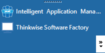
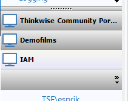

The Applications are created for a Project Version in the menu 'Setting up'. This application, together with the created roles and the user groups constitute the entire authorisation.

An application is a combination of a project with a project version, a server and a database that will appear as a standalone application in the GUI. A project version can therefore result in several applications on different servers and/or for different databases. Each application has its own authorisation and user preferences.

## Create an application

A new application can be created via the applications screen.

Add application

As can be seen in Figure 14 a number of things must be completed to achieve this. A number of these things including the Project, the Version and the Server id can be selected from a drop down list. These have already been prepared by the IAM developer. The database will fill itself automatically with the name of the database in which the end product is located. If this is not filled automatically then it must be completed manually.

Under the component 'Settings' an icon can be assigned to the application and the application can be set to active. Making the application active implies that the users who are linked to it can log in. If setting up of the application has not yet been completed then it is recommended to leave this check mark unchecked.

In the last component, 'Environment', it is shown for which platforms the application is available and which proxy address will be used. This will also have to be completed manually when it remains empty.

## Application tasks

There are various tasks available within the Applications component.

Various available tasks

### Copy authorisation of application 

These tasks, among other things, make it possible to copy authorisation from one application to another. This is desirable when working in a DTAP principle whereby the Test Server is configured and now has to be implemented on the Acceptance or Production Server.

Copy authorisation of application

### Setting up themes

A default theme can be set up here as a group preference for all groups within one application.

### Apply roles and rights to the database

Roles and rights can be implemented on the database so that they become available in the end product.

**TIP**

A [non] System Admin user who want to allocate the rights to the database will need some extra rights. By using the next script this is arranged:

use \[master\]

GO

GRANT VIEW SERVER STATE TO \[LOGIN\_NAME\]

GO

### Delete an application 

It is possible to delete the applications, when they are no longer in use. The entire structure that is created is then deleted. This takes place with the task 'Delete application'. Make sure that this is not done when the authorisation still has to be copied to a new application.

**Tip**

By keeping IAM tidy, the performance will remain good.

## Translations

The application translations are specified in this section.

Translating the application name

A tooltip text can also be added. A longer name or additional information can be added. If the tooltip is not translated, no name will be displayed.
