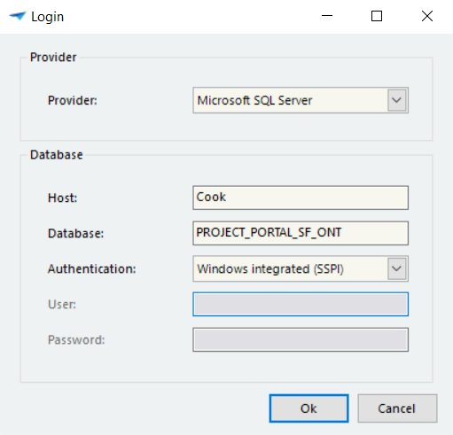

Applications are developed with the Thinkwise Software Factory. The Intelligent Application Manager (IAM) retrieves a copy of the (GUI) model from the Software Factory database. On the basis of this model the authorisation is set up via roles, user preferences can be defined and use of the GUI is registered.

The abstract Thinkwise GUIs interpret the GUI model from the Intelligent Application Manager together with the authorisation and user preferences, so that each user gets his own personal application.

The following diagram gives a schematic view of the operation and positioning of the Intelligent Application Manager.

> TODO: IAM schematic view

Synchronize
-----------

To include a new or existing project version as an application in the Intelligent Application Manager it is necessary to synchronize it with the Software Factory. This means that the blueprint is copied from the Software Factory to the Intelligent Application Manager. As soon as this has occurred, then the project becomes available in the Intelligent Application Manager. An application can be linked to this together with the roles and user groups. Synchronization is accomplished via the \'Synchronization\' task. This task is available in the menu under the group 'Model'.

Synchronize

In order to synchronize you have to first establish a connection with the Software Factory in which the project that has to be synchronized is located. The following popup indicates the Software Factory database you have to connect to.

Logging in on the server

## Select project version

After the connection has been established the required project and project version is selected.

Synchronize project version

### Determine target

By default, the synchronization will have an effect on the Intelligent Application Manager. The choice can be made to write the synchronization to disk by checking the 'Save in file' check mark.

This ensures that the synchronization does not have a direct effect on the Intelligent Application Manager. The SQL code that is normally executed during the synchronization on the Intelligent Application Manager will now be written to the specified file. And the SQL script can be executed manually on the Intelligent Application Manager database.

The SQL script can become so large that it is not possible to execute it via SQL Server Management Studio. SQL Server Management Studio gives the warning "Query completed with errors" without any further messages. In order to run the script you should in this case use the sqlcmd utility.

When using System-I Navigator to run the script, it is recommended to checkmark the options *Defer Run History* or *Defer Execution History*. This option makes the throughput of a lot of instructions much faster.

## Validation

When synchronization is now clicked on the system will first carry out a validation on the project. This checks whether the project satisfies all requirements to be able to later operate as an end application. When all validations have already been checked by the developer in the Software Factory then the check in the IAM should not produce any problems.

Force synchronization

Whenever an error is discovered this must first be resolved by the developer. It can however also occur that messages are displayed that we want to ignore for now. If this is the case then the 'Force synchronization' check mark can be checked. This ensures, despite the validation messages, that the project is synchronized.

## Result

As soon as the project version is synchronized the model is available in the Intelligent Application Manager. An application can now be created for this, which can subsequently be configured and authorised.

Projects
--------

The 'Projects' component contains an overview of all the projects that have been synchronized to the Intelligent Application Manager.

We also see here the 'Project Administrators' tab. Persons can be linked to this and start work as an administrator for the selected project. This implies that this administrator can create roles for the project for which he is responsible. Under the heading 'Period' it can be indicated when someone\'s administration function expires. This function is useful if a person only has a specific administrators task temporarily, for instance, due to the vacation of a colleague who is normally the administrator.
