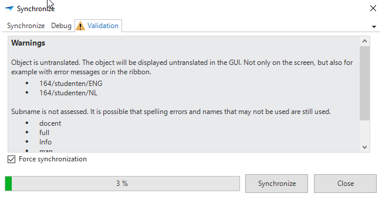
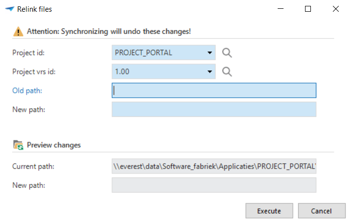

To make an application available in IAM, the model of the application must be synchronized from the Software Factory. Upon synchronization, the Intelligent Application Manager retrieves a copy of the model from the Software Factory database. 

After synchronization, roles need to be created for the project version and one or more applications need to be set up.

Synchronization
-----------

To synchronize a project version, start the *Synchronize* task from the *Model* menu.

*Synchronize*

The following pop-up is shown. Click the *Connect* button to establish a connection with the Software Factory in which the project that has to be synchronized is located.

After the connection has been established, select the required project and project version.

*Synchronize task popup*

By default, the synchronization will be applied to the current Intelligent Application Manager. It is also possible to save the synchronization to file, by checking the *Save to file* option. This allows you to script the synchronization for future use. The generated SQL script can be executed manually on any Intelligent Application Manager database.

>  When using the IBM System i Navigator to run the script, enable the *Defer Run History* or *Defer Execution History* option to speed up the execution.

### Validation

Click the *Synchronize* button to start the synchronization. The Intelligent Application Manager will perform a full validation of the project version before it is synchronized to check the integrity and quality of the project version.

Any error messages must be resolved before it is allowed to synchronize the project version.

*Validation*

> Only use the Force synchronization* option when you know what you are doing.

### Result

As soon as the project version is synchronized, the model is available in the Intelligent Application Manager. An application can now be created for this which can subsequently be configured and authorized.

Projects
--------

The *Projects* screen contains an overview of all the projects that have been synchronized to the Intelligent Application Manager. 

> In order to guarantee the performance of the Intelligent Application Manager and to optimize the startup time of the user interfaces, it is highly recommended to delete old project versions!

After synchronization, run the *Relink files* task on a project version to update all file references in a Software Factory model to the desired configuration for the production environment.

*Relink files*

### Project owners

Additional [project owners](../iam/administrators), who can create roles for a project, can be added to a project in the *Project owners* tab page.