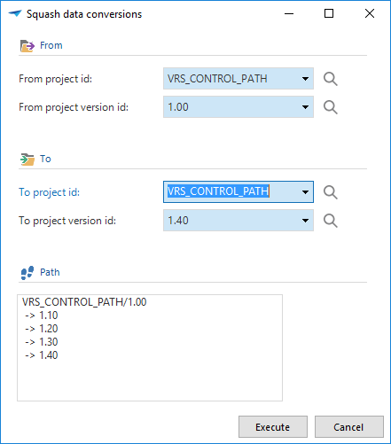

A very important step in the preparation for an upgrade is setting up version management for the data conversion. If version management is not applied correctly, this can ruin the database. Best case scenario, the upgrade-script will fail and a back-up must be restored. However in the worst case, the upgrade will be carried out without an error message but with data being lost.

The data conversion screen has four tasks:

- Refresh data conversion – deletes the generated records and the data conversion is re-built from that point

- Amend previous version – amends the previous version of the project version. After this a data conversion is created for the new upgrade

- Delete data conversion table – deletes one record with the underlying columns

- Delete data conversion – deletes all data conversions between two versions

The first step is to check the selected previous version. This ensures that the new version is created from the correct version. That the data is converted to the new version on the basis of the correct version. When work is carried out with various branches and/ or several versions, it can be confusing which version is the correct version to use to create a new version. With the sf\_product\_info table in the database it can be checked which version is correct.

Through the use of the *Update previous version* task, the previous project version and data conversion mapping can be converted. It is possible to define a ​mapping for various earlier project versions, but as default only the mapping for the current previous version is shown.

## Matching tables or columns

Data conversion will automatically attempt to match the old tables and new tables on the basis of nomenclature. If the match is successful, the *from* table id and the *to* table id will be filled and the status will be set to *Modified*. When a table is renamed the data from the old table must be added manually to the new table. This is done through the addition of the old table name to the *from* table id in the new record and then updating the data conversion again. The matching will be updated and the old record will be deleted.

## Splitting tables or columns

Sometimes a table has the same name as previously but a different function after the conversion. The data is therefore no longer correct and the new table must be empty after the upgrade. This is done through the deletion of the value from the *from* table id and then updating the data conversion again. There is then a second table with the status *Deleted*.

## Rebuilding tables

Even though nothing has changed, it can still be desirable to rebuild a complete table. When the structure of a table can no longer be guaranteed it can be desirable to rebuild it. 

## Default values for new columns

After the tables and columns are matched it is possible to set a default value for a column. The difference between the default value during the data conversion and the default value in the data model is that the default value of the data conversion is only used during the upgrade.

## Squashing 

When making a lot of small changes in different project versions it can be desirable to combine these project versions into one version before upgrading to one new version. There is a task available to squash these changes in the data conversions.

*Squash data conversions*

Consider the following example: In version 1.10, column x is renamed to y. In version 1.40, the same column is renamed to z. By squashing the data conversion between 1.00 and 1.40, the Software Factory will automatically rename column x to z.

