The data model screen allows you to visually design the data model of your application. A data model consists of tables, containing columns, and references, to create relations between tables. 

Rows (records) can be stored in a table. Each row consists of fields (columns). **Views** can also be included in a data model along with physical tables. A view gives a runtime presentation of data from one or more tables in one concentrated overview and is therefore always up-to-date. There are no rows stored in a view. It is also possible to create a **Snapshot** . In a snapshot, just as in a view, data from one or more tables can be combined, but in a snapshot this data is actually saved. This can considerably improve performance. The RDBMS has provisions to easily refresh the data in a snapshot (sometimes even automatically).

A reference is a relation between tables. The integrity between these tables is automatically guaranteed on the basis of a column comparison. A reference consists of a target and source table. The source table is the lookup table.

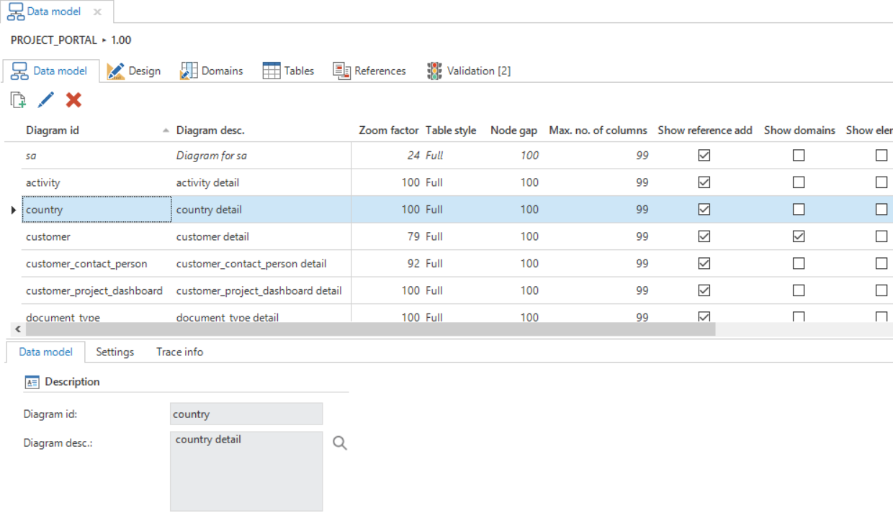
*The Data model screen*

## Diagrams

Since a data model can consist of many tables with columns an overview can quickly become very unclear. To avoid this it is possible to produce several diagrams each describing a subset of the complete model. A task is available to produce one's own diagram. This diagram is always at the top of the list of diagrams and can only be used by the user who is logged in. This prevents two developers getting in each other's way when designing.

### Design

Diagrams, and therefore the data model, can be designed graphically via the *Design* tab

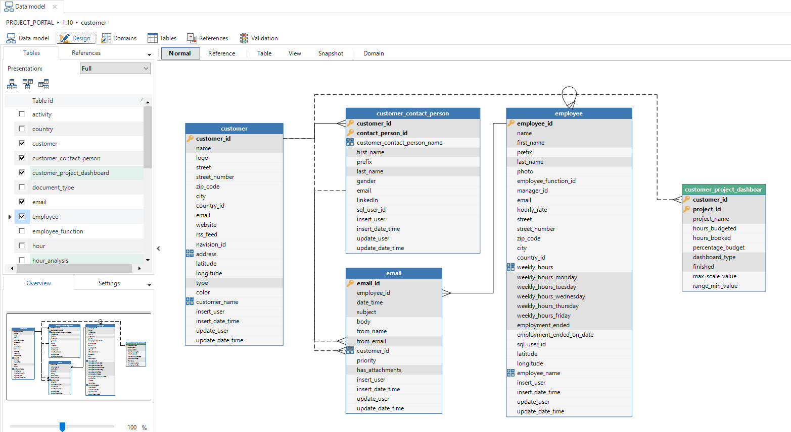
*Tables and views in the Design tab page*

This screen has a number of functions that help when designing the data model. A list is visible in the left hand column with all the tables and views. Behind this there is a similar list with all the references. These can be checked and unchecked to use them within the diagram.

Under this list there is an overview of the diagram and there are a number of standard parameters that can be modified.

Tasks are available above the tables to automatically add extra levels or link tables to the diagram.

The *One level deeper* and *One level higher* tasks select all linked tables above or below the selected table. This allows fast development of a diagram, which displays linked tables.

The *Link table* task automatically creates a link table between two tables. It can be indicated in the popup which table is the main table and which is the subordinate.


To create a link table between to tables, both tables must have a primary key

### Diagram options

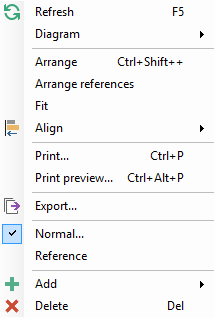

The context menu (right-hand mouse button in the work sheet) offers the following options:

- Refresh - re-load the data model, for instance, to see modifications from other designers.

- Diagram - has a sub-menu to save, load and rename diagrams.

- Arranging - produces a graphical display by manually positioning the tables yourself. The distance is determined through an option in Settings.

- Arrange references - leave the tables alone, but position the references so that they do not run through the tables.

- Fit to screen - remove the white edges around the data model.

- Align - has a sub-menu to align selected objects in various directions.

- Print - the data model is printed on the standard printer.

- Print preview - displays a print preview.

- Export - has a sub-menu to export the graphical data model to various formats such as GIF, PNG, PDF, etc.

- Normal/Reference - switch between *Normal* and *References*. If *References* is selected it is possible to draw references between columns.

- Add - a table or reference can be directly added to the model.

- Delete - Delete a table or reference from the diagram and/or model. With delete table, the table is not deleted but only removed from the data model. With delete reference there is a choice between removing the reference just from the diagram or also from the model.

Adding new domains, tables and views is available in the tabs behind the subject field, but can also be easily done via the buttons in the diagram.


## Tables

An overview of all tables is accessible via the *Tables* tab page.

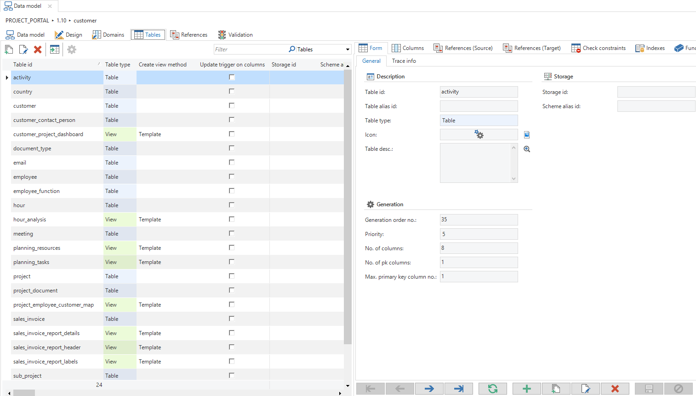*Overview of the 'Tables' tab*

The columns are defined within a table under the *columns* tab. A column has the following properties:

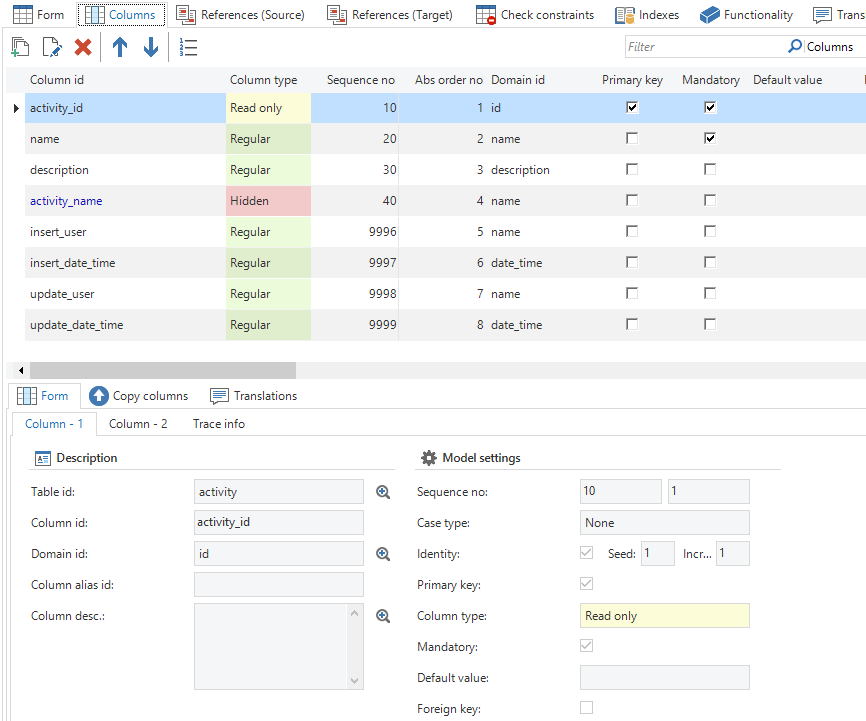
*'Columns' tab within 'Tables'*

### General

- Project id - of the current project.

- Version id - of the current project version.

- Table id - the table within which the column is created.

### Description

- Column id - the column name in the database.

- Domain id - determines the data type and control of the field.

- Column alias id - a column alias can be optionally added here.

- Column description - a description of the column can be optionally placed here.

### Model settings

- Sequence number - determines the physical sequence in the database.

- Case type - determines whether this field is only filled with upper case letters, lower case letters or a combination of both.

- Identity - the database will automatically issue a number for this field
  
  - Seed - begin value of the number.
  
  - Increment - steps with which the number is increased.

- Primary key - indicates whether the field is part of the primary key.

- Type of column - determines how the column is displayed (Normal / Read only / Hidden).

- Mandatory - determines whether a field is mandatory or optional.

- Default value - fixed value that is filled in when adding a record, with a change this value is not filled in.

- Foreign key - indicates whether a field is a foreign key from another table.

### Calculated field

- Type of calculation - indicates with which calculation the field is filled. A choice can be made from
  
  - None - the user enters a value himself
  
  - Expression - the GUI executes the calculations. This is not stored in the database. The column itself is also not stored in the database -
  
  - Calculated column - the database executes the calculation and stores this in the table.
  
  - Calculated column (function) - the database executes the calculation with the help of a function.

- Query calculated field - in which a query can be specified to have a value in this field calculated by the GUI or database, for instance *price \* quantity*. This value is not stored in the database.

### Other options

- Alias - used in DB2 and Oracle to provide a short name for a table.

### Expression dependencies

It is possible in the Software Factory to define virtual fields that are not stored in the database but are evaluated by the user interfaces. This type of field is called an *expression field*. For these expression fields, that are sometimes also called look-up info fields, no upgrade of the end product is necessary.

**Example**

A person can be displayed as first name + prefix + surname. This name is composed and therefore does not have to be stored in the database, but is often used in the GUI.

With calculated fields a query must be provided with which the value is retrieved by the user interface. For instance, this can be a composition of several fields, a (range) function or a subquery. Reference can be made in the query to other fields from the table by using the alias t1.

The query that is provided with expression fields will be added to the select clause of the query. For example:

```sql
select 
t1.[customer_id], 
t1.[customer_naam], 
(  select t1.street + t1.number_number + c.name
   from country c 
   where c.country_id = t1.country_id
) as t1.[address]
from customer t1 
```

The columns on which the expression is dependent are shown on the *Expression dependencies* tab. If one of these columns changes in the end application, then the expression field will also be updated. If, for instance, *street* changes, then the composite address must use the new street.

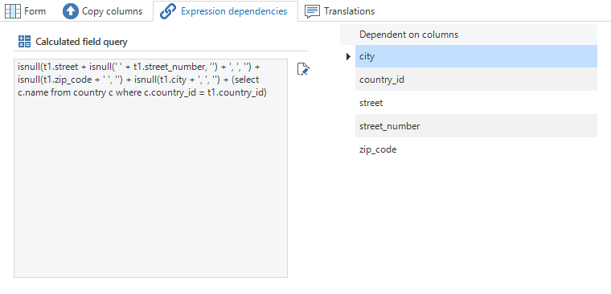
*Calculated field with a Query*

## Views

A view is a logical table that is composed from fields from other tables. The data in a view is not stored in the database, but composed at runtime on the basis of a query.

A view is created in the same manner as a table and has a number of additional options. One of these options is the choice in which way the view must be created. There are three options available for this.

### Automatic

This method is used when only data from the linked (source) tables need to be used in the view.

The *from clause* is created automatically. This is generated but it can also be forced by executing the *Generate view from clause* task.

### Modifiable

Use this method to be able to modify the *from clause*, *where clause*, *group by clause* or *having clause* of the view. The *select clause* is built up on the basis of the *view table* and *view column* fields in the columns.

### Template

The last option provides the possibility to write a template in which the entire select query is written, which then needs to be woven into the view.

The *Template* option provides the freedom to use the most complex selection structures or to construct them dynamically. Creating this template is explained in paragraph 0

### Copy columns

All columns are available for copying to the created view in the *copy columns* tab. The selected columns are copied to the view using the *Copy* button.

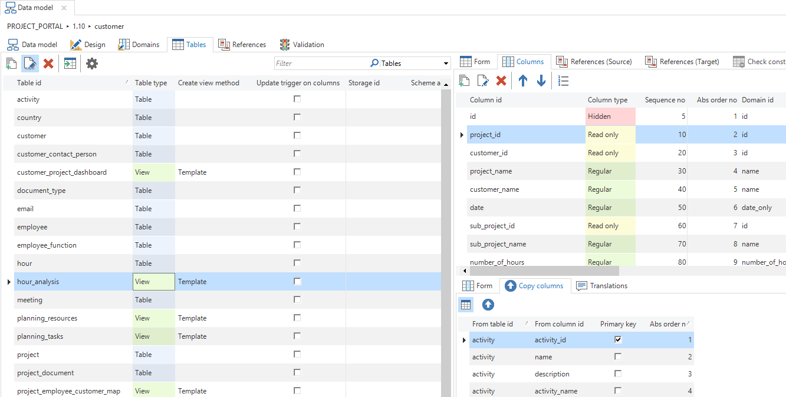
*A view with the option to copy columns*

When this takes place, a popup screen appears with the option to enter a prefix. This prefix is placed before the name of the copied column. For example, the name column can be copied from the employee table with the prefix *employee*. *Name* is now displayed in the view as *employee_name*. When the column name starts with the prefix then the prefix is not added for a second time.

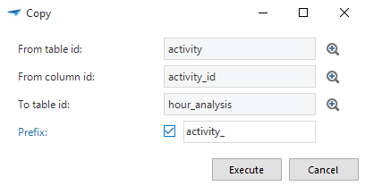
*Popup that appears when tables are copied*

After all columns are defined and/or copied and *Automatic* or *Modifiable* is chosen for the view option then the *from clause* of the view can be constructed by executing the *Generate view from clause* task. 

## References

A reference is a relation between two tables. The target table has one or more fields (the foreign key) of which the combined values must appear as the primary key in the source table. This column comparison is specified in the reference columns.

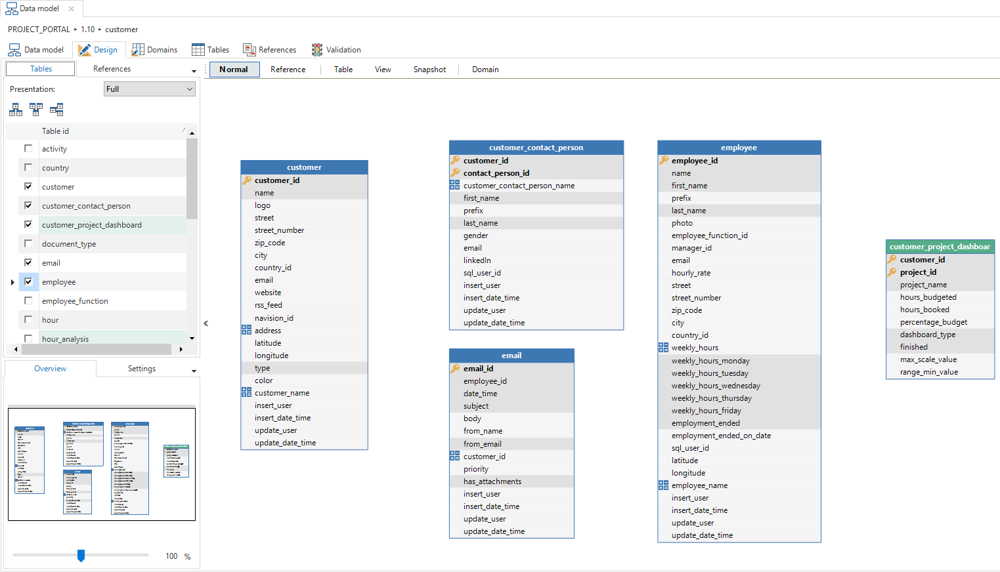
*Tables and views in the 'Design' tab without references*

References can be created by means of *drag & drop* in the *Reference* status. In the *Normal* status the *Reference* status can be temporarily activated by holding down the Ctrl key. This makes it possible to create a reference by dragging with the mouse from the source to the target table. A popup then appears in which the column comparison is presented.

The column comparison is based on the primary key of the source table: which therefore has to be present. If a column from the source table does not appear in the target table then a check mark appears in front of the column to indicate that this column will be created. This check mark can be unchecked whereupon an existing column from the target table must be chosen. Only columns that have the same domain as the column in the source table can be linked.

When adding or modifying a reference it can also be indicated whether the reference must be used as detail and/or as look-up.

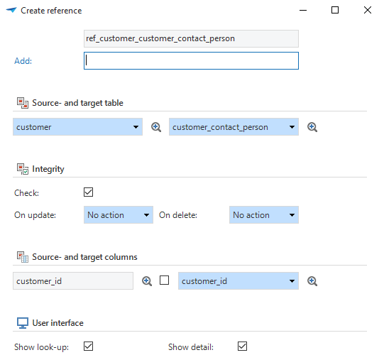
*Popup for creating references*

It is possible to switch off the integrity check of the reference by the RDBMS by the unchecking the check mark next to *Check integrity*. The reference then only serves to display details or look-ups in the user interfaces.

Incidentally, just the integrity between tables can be checked. When the source or target table is a view, the *Check integrity* option is turned off as a default.

## Validation

Validating the data model is possible in the *Validation* tab. Through this errors can already be identified at an early stage. The *Validation* component is explained in more detail in paragraph 7.13.

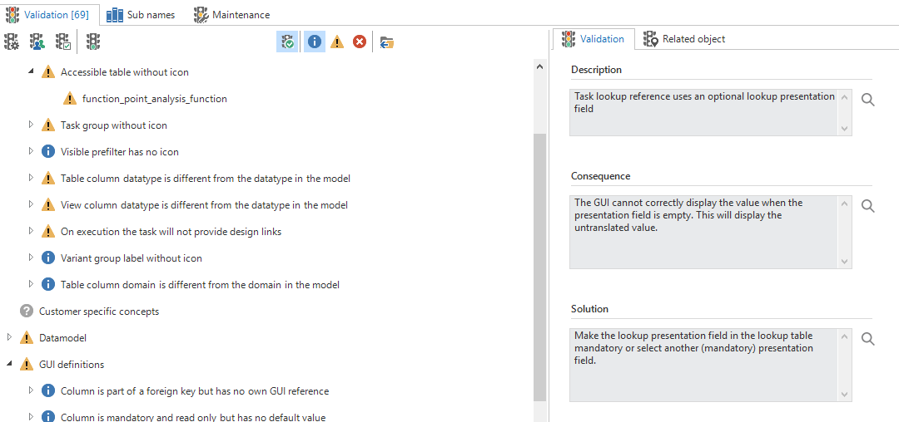
*Example of the validation screen*

### Starting the application

When the data model is completed the database can be created, this is described in [Creation](creation.html). Since there is still no user interface set up there is nothing visible in the end product. The tables are accessible after the menu has been set up. 

Starting the user interface is possible once the database has been created, or by using the *Mock Database Provider* to display a preview without an end product database. 


