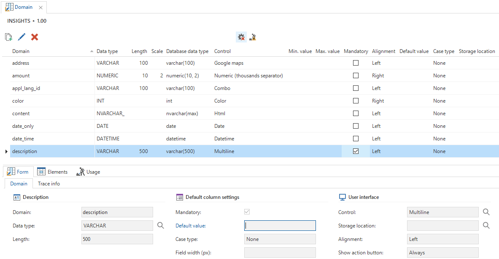
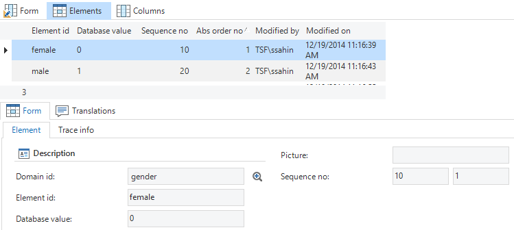
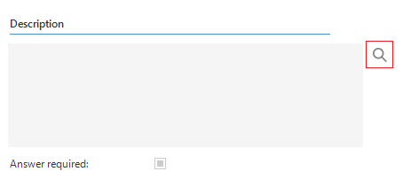
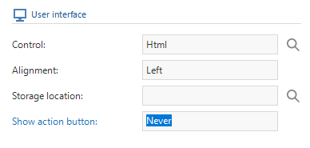

Domains are abstract data types, used to indicate the data type of columns and parameters. Changing a domain will update all columns and parameters that use this domain. Depending on the database management system, *user-defined data types* or *reference-fields* are created for domains to be used in SQL business logic. 

A domain always contains a data type and possibly a length and precision. A domain can optionally contain *domain elements*, to offer the user a pre-defined selection. A *control* can be specified that is used to visualize the columns and parameters in the user interface, for instance as a text field, an image or a checkbox. See [Controls](subjects#controls) for more information.

Several default settings for columns can also be provided. An example of this is the *Mandatory* field. If this is checked new columns created with this domain are also mandatory by default. You can still uncheck this option on a per column basis.

*Overview of the Domains tab*

*Adding elements to a domain*

### Control action buttons

Some fields are always readonly, used only to show data. The *Show action button* option allows you to hide the action button for domain. There are three options:

- Never
- When editable
- Always

*Control with action button Always*

*Show action button*