The *Development* component contains the components that are necessary for the development and testing of business logic on the application that cannot be modeled. These are not only the [business rules](https://en.wikipedia.org/wiki/Business_rule) for adding, modifying and deleting (triggers, procedures and functions), but also the control of the GUI (defaults, layouts, context and badges), process flows and messages.

## Templates

Functionality is written in the form of templates based on the functional description which has been drawn up when modelling the application logic.

The functionality screen consists of seven components:

- Control procedure; This is where you will find the control procedures in which the functionality that is to be written will be placed. You will also find a description here of how the functionality is woven, static or via SQL.

- Template; In this step the source code pattern that is to be woven will be determined.

- Assigning Template; If the choice has been made for static assigning, the template will be assigned to the various program objects and for each object any parameters will be replaced by values.

- Result; This is where the program objects which make use of the template are (re)generated and immediately applied.

- Test case; It is possible to link test cases to each control procedure. This will be discussed further in chapter 0.

- Validation; It is advisable to regularly validate. This tab only displays the validations that apply to functionality.

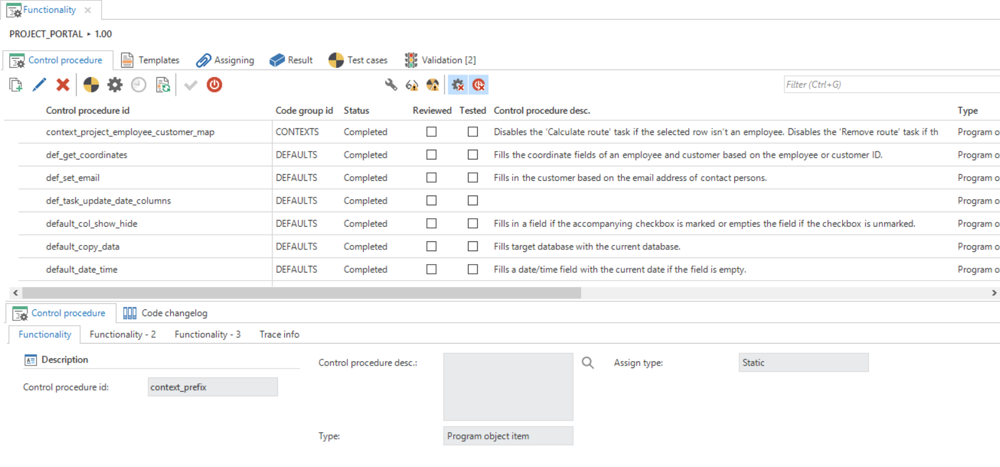

Figure 203: 'Application logic' tab for 'Functionality'

### Types of functionality 

Business functionality can be integrated into various types of program objects.

Figure 204: Schematic overview of the various types of program objects

| Code group    | Control from GUI | Function                                                                                                                                                                                                                                                                                                     | Activation                                                                                                                                                                                                                                                                                      |
| ------------- | ---------------- | ------------------------------------------------------------------------------------------------------------------------------------------------------------------------------------------------------------------------------------------------------------------------------------------------------------ | ----------------------------------------------------------------------------------------------------------------------------------------------------------------------------------------------------------------------------------------------------------------------------------------------- |
| Default       | Yes              | Changes the value of fields during import or modification on the basis of values that are entered into other fields. Moves the position of the cursor on the basis of the entered fields.                                                                                                                 | Is called automatically: as soon as the user clicks on Add In edit mode, as soon as a field that has been modified by the user is exited                                                                                                                                                  |
| Layout        | Yes              | Determines the visibility of fields and whether fields are modifiable and mandatory during import or modification on the basis of values that are entered into other fields. Determines the availability of the data manipulation buttons on the basis of the values in the fields of the current record. | Is called automatically: as soon as the used click on Add or Modify In edit mode, as soon as a field that has been modified by the user is exited If in non-edit mode another record is selected                                                                                       |
| Context       | No               | Determines which tasks, reports and detail tabs are available, given the values in the fields of the current record. Determines the active detail tab on the basis of the values in the fields of the current record.                                                                                     | Is called automatically if in non-edit mode another record is selected.                                                                                                                                                                                                                         |
| Process       | Yes *            | Following a process action, determines which following process actions must be carried out and in which sequence. Can make use and exercise influence on process flow variables.                                                                                                                          | Is called automatically when an action is executed that is part of a process flow.                                                                                                                                                                                                              |
| Trigger/Event | Yes              | Performs controls to possibly reverse transactions or updates other fields or rows in other tables.                                                                                                                                                                                                          | Is called automatically after data in a table is added, modified or deleted.                                                                                                                                                                                                                    |
| Task          | Yes              | Standalone (business) functionality.                                                                                                                                                                                                                                                                         | Is explicitly started by the user or by means of scheduling (batch).                                                                                                                                                                                                                            |
| Badges        | Yes              | Determining the number that is shown on the badge of a subject, task or report.                                                                                                                                                                                                                              | Automatically on the predefined interval and after data modification of the subject in question.                                                                                                                                                                                                |
| Other         | No               | Determines the operation of a subroutine.                                                                                                                                                                                                                                                                    | Depending on the type of subroutine. The user interface never makes explicit use of subroutines. Other logic concepts can make use of this. There are no application specifications written for this. They cannot be found in the user interface and fulfill no specs, but support other logic. |

Table 8: Explanation of the type of program objects with application logic.

\* A task may also be called from another procedure or trigger.

Each table (or view) has:

- one default procedure

- one layout procedure

- one context procedure

- three triggers or events (insert, update and delete) of each type (*after*, *before* and/or *instead of*, depending on the application logic layer and the RDBMS).

In addition, tasks can be linked to several tables and views.

A process procedure is generated for each process action.

The code in templates with which the application logic is developed is highly dependent on the platform, that the end product uses. The information available when performing the logic (the context), and the possibilities for each logic concept are almost identical for each platform, but the code is different.

Some points of attention:

- The code groups are often identical to the logic concepts as discussed in this manual. However, it may occur that certain logic concepts are included in different code groups.

- Examples have been worked out in this chapter, in which the end product makes use of a platform that supports Transaction SQL. The way in which the execution context is read out and the values are set, may differ on the various platforms. However, the information that contains the execution context and the possibilities for the application of logic are practically the same for each platform.

The different interfaces of the different types of program objects are discussed in the following paragraphs.

#### Default

The following options can be set within a Default:

- The value of each field.

- The name of the field where the cursor will be placed.

The following context is provided when executing the Default logic:

- Default\_mode; Indicates whether it concerns an insert (0) or an update (1).

- Import\_mode; Indicates whether it concerns an import or synchronization action.

- Cursor\_from\_col\_id; The field that the user has left. The value is null immediately after adding or modifying.

- Cursor\_to\_col\_id; The field where the cursor must move to, after leaving the default procedure.

- \[Col\_id\]; All columns in the table, both input and output. Every value can therefore be modified.

**Example**

This Default template code ensures that the current date is set for the *activated\_date* field when the 'activated' field has just received the value 1.

**Note**

The default logic is not limited by settings in terms of visibility and processability, both at a model level and through authorization.

#### Lay-out

A layout can be used to disable fields and operations, depending on the context. The following settings can be made:

- Make fields read-only, invisible and hidden.

- Make fields mandatory.

- Disable or hide add, change, delete, save and cancel buttons.

The following context is provided when executing the layout logic:

- Layout\_mode; Indicates whether it concerns an insert (0) or an update (1).

- Import\_mode; Indicates whether it concerns an import or synchronization action.

- Add\_button\_type; Indicates how the corresponding button should be displayed:
    
      - 0 = enabled
    
      - 1 = disabled
    
      - 2 = hidden

- Update\_button\_type; Ditto

- Delete\_button\_type; Ditto

- Confirm\_button\_type; Ditto

- Cancel\_button\_type; Ditto

- \[Col\_id\]; All columns of a table. These values can be used to make decisions about the behaviour.

- \[Col\_id\];\]\_type; The type can be modified for each field:
    
      - 0 = normal
    
      - 1 = read only
    
      - 2 = hidden within the form (space remains reserved)
    
      - 3 = hidden outside the form

- \[Col\_id\]\_mand; Whether fields are mandatory can be set for each field:
    
      - 0 = optional
    
      - 1 = mandatory

The variables for type and mandatory only need to get a value if it differs from the default value of the meta-level. It is therefore not necessary to reset the value.

**Example**

In the following layout template code, the *activated\_date* field is made mandatory when the user is navigating around the screen and the 'activated' field has a value of 1. The *activated\_date* field is hidden outside the form when the *activated* field has a value of 0.

**Note**

The layout logic does not have the possibility to provide more access than the model and authorization settings allow. For example, when a column in the model is set to hidden, the field cannot be set to read-only by means of the layout procedure. A layout can only restrict.

**Note**

The layout logic should always be written in such a way that the fields are stateless. For example, when a field is made mandatory by the layout logic, this change applies until the next call of the layout logic. If the field in the layout logic is subsequently not explicitly set to mandatory again, the status of the field will revert back to the default setting.

#### Context

A context procedure offers the following options:

- Disabling and hiding detail tabs.

- Disabling and hiding tasks and reports.

- Changing the active tab.

The following information is given when executing the Context logic:

- Active \_ref\_id; Displays the name of the active reference tab.

- \[Col\_id\]; All columns of a table. These values can be used to make decisions about the behaviour.

- \[Ref\_id\]\_type; Indicates whether a reference tab should be displayed:
    
      - 0 = enabled
    
      - 1 = disabled
    
      - 2 = hidden

- \[Task\_id\]\_type; Indicates whether a task must be displayed:
    
      - 0 = enabled
    
      - 1 = disabled
    
      - 2 = hidden

- \[Report\_id\]\_type; Indicates whether a report must be displayed:
    
      - 0 = enabled
    
      - 1 = disabled
    
      - 2 = hidden

**Example**

The following template disables the detail tab *inactive\_property* when the *activated* field has a value of 1.

**  
**

**Note **

The Context logic does not have the possibility to provide more access than the model and authorization settings allow. For example, when a detail tab in the model is set to hidden, the detail cannot be set to visible by means of the Context logic. The Context logic can only restrict in this instance.

**Note**

The Context logic should always be written in such a way that the fields are stateless. For example, when a field is hidden by the Context logic, this change applies until the next call of the Context logic. If the field in the Context logic is subsequently not explicitly set to hidden again, the availability of the field will revert back to the default setting.

#### Badges

Badges can be used to indicate to the user that there are still open tasks or the like. These are numbers for a table, view, task or report.

Two parameters are available for adding badges:

1.  @variant\_id/V\_VARIANT\_ID

Badges can be created for a specific variant. This in contrast to all other functionality, for which a stored procedure works for an entire table.

Thanks to the @variant\_id parameter it can be indicated for which variant a badge must apply.

2.  @badge\_value/V\_BADGE\_VALUE

With this variable the number is determined that is displayed by the GUI. Currently only an integer can be used with a value between 0 and 99. This will possibly be extended in the future.

When a badge is created a code can appear as follows:

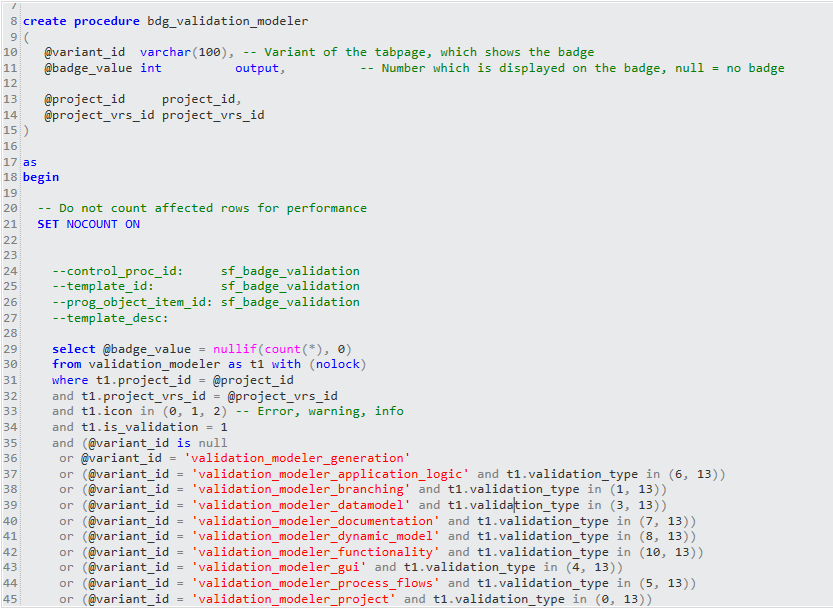

This is presented as follows in the end product (Validation \[8\]):

#### Process

A process procedure offers the possibility to influence the further course of a process flow by means of the followig options:

- Changing the sequence of the next immediate steps to be taken.

- Enabling and disabling subsequent steps.

The initial status of the subsequent steps is available in all Process logic. This status is determined by the way in which the just executed process action has been completed. When unsuccessfully completed, the subsequent steps for a successful execution are disabled. When successfully completed, the subsequent steps for an unsuccessful execution are disabled. The sequence of the remaining subsequent steps is determined by the settings in the model.

Whether or not a process action has been successfully completed, is shown by the status of the subsequent steps, which represent successful and unsuccessful completion.

All process flow variables marked either Process input or Process output can be respectively used or modified in the Process logic.

No further options are present in the context for types other than those specified in this overview. When an action has not been completed successfully, it may be that certain field values have not been filled.

**Example**

The following template ensures that the next step to *display\_report* is not executed when in the task process action *execute\_calculation* the parameter *calculation\_type* has the value *test\_calculation*.

#### Trigger/Event

Trigger or Event based logic is performed around the data manipulation. This logic concept is highly platform dependent. This logic concept offers the following possibilities:

- Perform actions as a result of (attempted) changes in data.

- > Prevent/undo changes in data (control)

In general, the concept can be divided into three types, with three moments per type. The available context is different for each type.

- Instead of / before / after performing an add action
    
      - The field values of the record(s) to be added or that have been added.

- Instead of / before / after performing a modification action.
    
      - The old and new field values of the record(s) to be changed or that have been changed.

- Instead of / before / after performing a delete action.
    
      - The field values of the record(s) to be deleted or that have been deleted.

**Example**

The following trigger ensures that when deleting an order, a record is written to the log.

#### Other (Procedure, Function etc.)

In addition to the above logic concepts, there are platform-specific components that are often defined on the basis of a subroutine. These logic concepts can be used in other logic components. Consider, for instance, database functions: The context of this logic is generally consistent with the parameters defined for a subroutine.

### View/Snapshot

View and Snapshot logic determines the contents of a view or snapshot respectively. This logic can only be applied in template-based views and snapshots. In the template the complete query is defined for the data that will be displayed by means of the view or snapshot.

When modeling a view the developer provides the columns which must be available in the view. This is explained under the data modeling component. These columns become available when writing the functionality as parameters. All these parameters must also be used in the code.

A piece of code for a view could then look as follows:

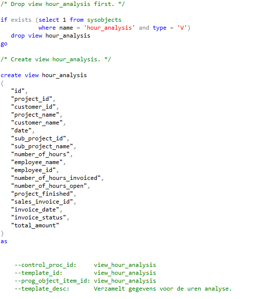

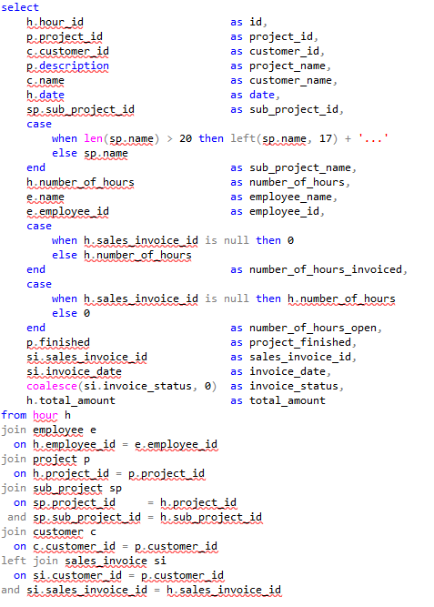

### Offline logic

It is possible to write offline functionality in the Software Factory. This functionality works on top of the existing functionality in the service layers of the database. With offline functionality, which is written in JavaScript, it is possible to also apply business rules when a Mobile is offline. This way the user will have the same user experience as if he is online.

In order to get this functionality available in the SF the base project JAVASCRIPT must be added to Project Management.

Furthermore it is possible to update *volatile* data on the mobile clients before it is synchronized to the service layer and therefore to the database. For this purpose extra logic concepts have been added for JavaScript logic. These are: JavaScript tasks, Before and After task events and JavaScript triggers (Before/After/Delete). These can be filled through the usual control procedures.

By defining subroutines of the 'JavaScript function' type you can add generic functions to the offline javascript.

Offline logic needs to be implemented before it has an effect in Mobile. This will be explained further in chapter 10. The effects of synchronizing offline modifications following an upgrade are described in chapter 14.4.

#### Debugging offline code

In order to debug the offline functionality the following steps must be executed. This makes it possible to identify possible errors before they are returned as an error in the GUI:

The javascript code is also written to disk (if when generating you have checked "write to disk" in \[PROJECTMAP\]\\Source\_code\\JavaScript.

- Install nodejs ([*https://nodejs.org/en/*](https://nodejs.org/en/))

- It is now possible to execute "npm" from the command line.

- Execute the command npm install -g eslint

- Then go to the folder in which the offline code is generated

- You can execute "eslint ." : take note of the space full stop; this is important.

This now goes into the folder that controls the javascript files and in most cases can give reasonable error messages.

### Create functionality 

The step-by-step plan for creating functionality is discussed in the following paragraphs.

#### Control procedure

A new control procedure can be created under the *Control procedure* tab. It is subsequently indicated how this procedure should be assigned, static or via SQL.

Thinkwise recommends entering the name of the developer when creating a control procedure so that if there are any questions about the development, the right developer is always easily accessible. The developer tests his own template and sets it to complete when it is complete. Since a developer only works on one template at a time, each developer only has 1 template at the most *under development*. The exception is a group of templates that form a logical unit. The review check mark is subsequently checked by the project manager. He determines who tests which templates.

#### Templates

The template that is going to be woven into the application is linked in the templates tab.

Most procedures have one template for weaving. Hence, the template id and description can be copied as default from the control procedure. The sequence number determines the default sequence of the program objects. These can still be changed for each program object at a later date.

The source code is subsequently defined in the Code tab of the form.

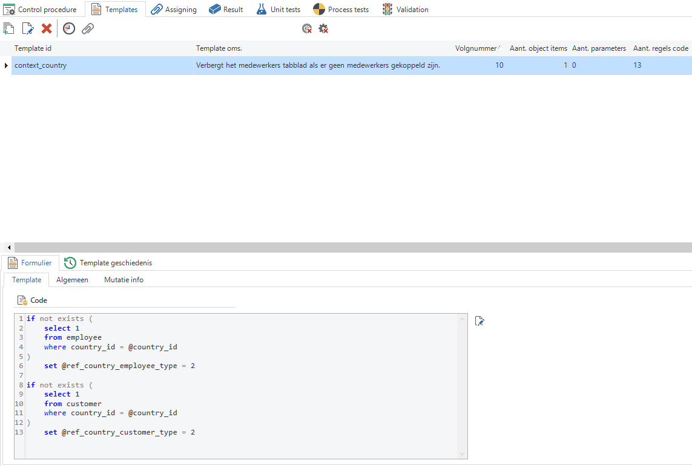

Figure 205: Adding code to the 'Template' tab

The code can be written directly in the Template tab and will be displayed as is usual with an editor such as Notepad++ or SQL Server Management Studio. If the preference is to work directly in the editor itself, you can click on the button next to the code template. A linked editor will open. Changes to the file are automatically reported back to the Software Factory.

When the control procedures or templates are modified, the history is stored in the Software Factory. Several tasks have been added to compare these templates and control procedures with the history. This makes comparisons between new and old code more transparent and easier.

It is also recorded when a template is modified and when the source code was last generated. After the development is finished, the control procedure should receive the status *Completed*. This is done by calling the *Complete control procedure* task. It must be indicated in the pop-up what must be included in the change log.

If subsequently a modification is made to the template or the control procedure, the control procedure will automatically revert back to the status of Development.

Figure 206: An overview of the old code templates, which can be compared with one another.

##### Parameters

A template can have parameters. These are placed in square brackets (e.g. \[COL\_ID\]). When assigning a template to a program object, the parameter is provided with one or more values. If a parameter has more than one value, the line of code containing the parameter, will be repeated as many times as there are values.

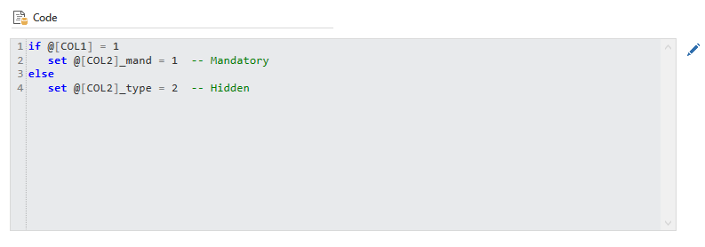

Figure 207: Assigning parameters by means of square brackets.

A parameter value can also be empty and by checking the *Ignore if empty* check box for the parameter, it can be determined that the source code line, containing the parameter, is not included in the end product.

##### IAM Authentication

When use is made of IAM authentication or connection pooling the User ID cannot be read by the RDBMS with use of *system\_user* or *user*.

Since this is often used in code, for example, to fill trace columns or to filter data on the logged in user Thinkwise has written its own solution for this. This solution is different for each RDBMS.

In SQL Server use is made of:

- select dbo.tsf\_user();

In DB2 this is:

- client userid;

- current client\_userid;

And in Oracle this is:

- V\_VARIABLE := SYS\_CONTEXT('userenv', 'client\_identifier');

**Note**

This method is not supported by Crystal Reports/Crystal Clear. In these cases the Users ID are offered to the report by means of import parameters. By making use of a *Default* procedure the correct ID can be provided.

#### Assigning

The left column shows all the program objects of the same type as the control procedure ((layouts, defaults, triggers, etc.). This can be sorted, filtered and searched with the default Thinkwise presentation functionality. By selecting these the corresponding program objects will be displayed on the bottom right. By using the arrow down button  the template can be woven into the program object.

**Note**

Logic concepts can be disabled through the settings found in tables, tasks, reports and process actions. This applies for default, layout, context and process program objects.

Disabled concepts are displayed in italics. No code is generated for disabled logic concepts and they are not used in the end product. When assigning a template to a disabled concept, this concept will be automatically enabled.

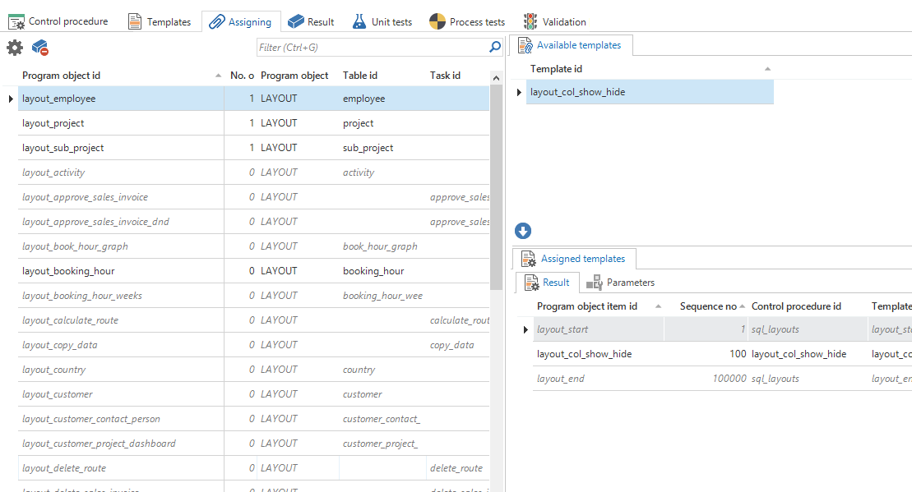

Figure 208: The 'Assign' tab with the list of program objects on the left.

A template can be assigned more than once. To do this, the program object item ID of the existing assignment must first be modified. This can be done in the list of program object items. Also, the sequence of the templates can be changed here by changing the sequence number.

If a template has parameters, these are automatically created on the Parameters tab. An icon on the tab indicates that there are still parameters without a value. If these are not automatically generated they can still be generated with the *generate parameters…*  task.

Figure 209: A warning that a parameter has not been entered

**Note**

A modified template is not stored when it contains the text “This file is disconnected…". This means that work is continued with an outdated version. Always ensure that the correct code is linked, otherwise this can result in a loss of code.

#### Result

If a new template has been woven or the template source code has been changed then the source code of the program objects must be regenerated. This can be done by clicking on the *Generate code* button.

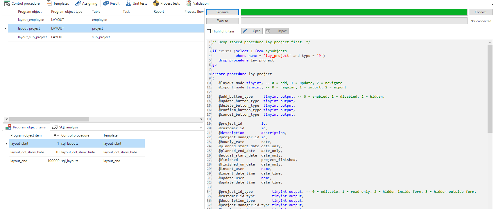

Figure 210: Overview of the 'Results' tab, where the code is generated and executed.

The objects can be executed on the database by making connections to the database.

The generated source code that corresponds with the program object item can be marked with the option *Mark item*. In this way, it is clear which part of the source code is generated by which program object item (and hence which template).

Due to the IDE link it is possible with the buttons Save, Open en Import to save and open the code in an external editor. Mainly for Java and C\# this provides the possibility to use Eclipse or Visual Studio after which the modified code can be imported back into the Software Factory. A pop-up screen clearly displays the changes.

Figure 211: Comparing added code and the previous template

### Code review

Code review makes it possible to review a code before accepting it in the Software Factory.

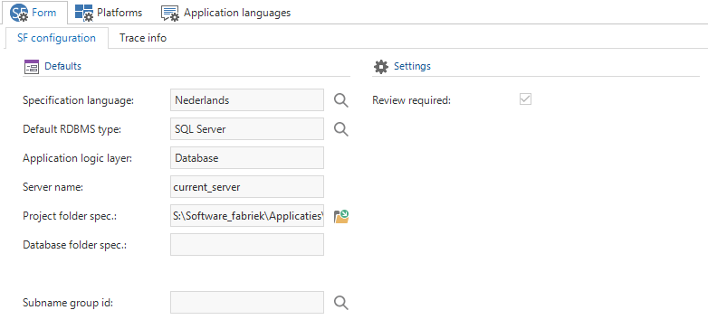

Figure 212: SF configuration settings

With Review required turned on, the task to complete a control procedure will be replaced by a task to set a control procedure ready for review.

Figure 213: "Ready for review..."

This task will set the status of a control procedure to the status *Review* and create a changelog record. The code changelogs, including the code changes, can be found in the *Code changelog* tab page. Two tasks are available in the code changelog. 

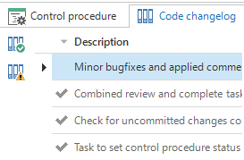

Figure 214: Code changelogs

These tasks can be used by a reviewer to approve or disapprove the changes. When approved, the control procedure will be set to completed. When disapproved, a comment will be required as review feedback and the control procedure will be set back to development. The comments can be found as a detail tab page under code changelog.

Figure 215: Review comments

The developer can choose to apply the comment to the code and resolve it, or mark the comment as *won*t fix* and optionally explain the decision made by replying with a comment. When done, the developer can set the procedure back to review.

A set of new control procedure icons have been added. The following table will show both new and existing icons for clarification.

| Icon                     | Description                                                  |
| ------------------------ | ------------------------------------------------------------ |
|  | Currently in development by another developer                |
|  | Currently in development by current developer                |
|  | Changes are disapproved, in development by current developer |
|  | Waiting for review, developed by current developer           |
|  | Ready for review, developed by another developer             |

For a reviewer, it may be useful to have a list of changelogs which are ready for review and to be able to review the code and leave comments, apart from the control procedure screen.

The menu item *Code review* is available for this purpose in the menu group *Development*.

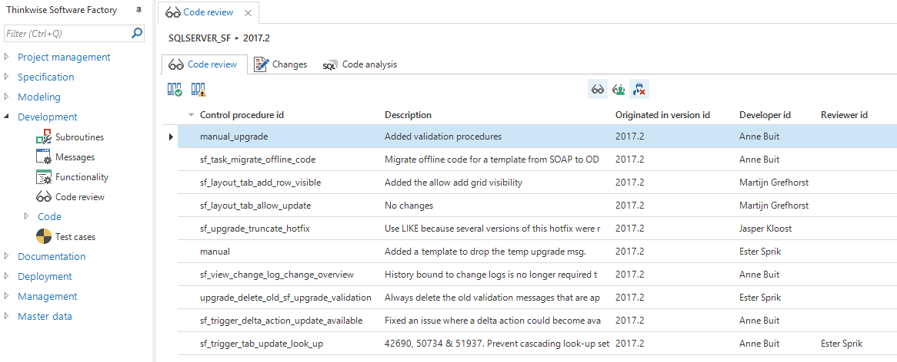

Figure 216: New Code review screen

 The functionality in this screen is basically the same as the *Code changelog* screen, which was explained earlier. However, this screen contains prefilters to hide approved changelogs, only show changelogs with the current user as reviewer, and hide changelogs with the current user as developer.

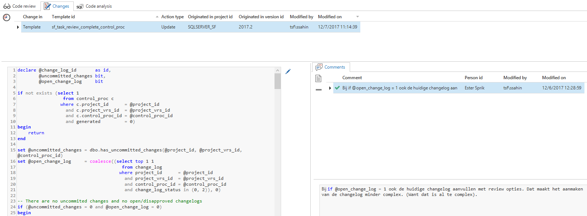

Figure 217: Review changes and add notes

As seen above, the Changes tab page shows the changes made in the code and the comments which are posted on the changelog.

### Code analysis

The Code Review screen also contains a SQL Analysis tab page, to perform a static code analysis of all T-SQL program objects using the Microsoft Data-tier Application Framework (DacFX).

After running the Code Analysis task for a specific control procedure, icons show whether there are any warnings or errors for every program object. At the moment, any issues that have to be resolved before code changes are approved are to be manually added to the code review comments. The analysis capabilities will be extended in future versions of the Software Factory.

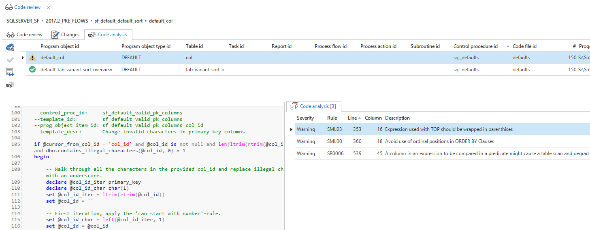

Figure 218: Code analysis

 In addition to the standard Microsoft rules, rules have been added from the Microsoft DACExtensions (<https://github.com/Microsoft/DACExtensions>) and TSQL-Smells (<https://github.com/davebally/TSQL-Smells>) projects, making a total of over 60 rules.

These rules cover:

- Type checking

- Use of patterns in LIKE predicates

- Potential SQL Injection Issue

- Avoid cross server joins

- Deprecated JOIN syntax

- Use two part naming

- Use of nolock / UNCOMMITTED READS

- Use of Table / Query hints

- Use of Select \*

- Explicit Conversion of Columnar data – Non Sargable predicates

- Ordinal positions in ORDER BY Clauses

- Change Of DateFormat and DateFirst

- SET ROWCOUNT

- Missing Column specifications on insert

- SET OPTION usage

- Use 2 part naming in EXECUTE statements

- SET IDENTITY\_INSERT

- Use of RANGE windows in SQL Server 2012

- Create table statements should specify schema

- View created with ORDER

- Writable cursors

- SET NOCOUNT ON should be included inside stored procedures

- COUNT(\*) used when EXISTS/NOT EXISTS can be more performant

- Use of TOP(100) percent or TOP(\>9999) in a derived table

### Under the hood

This paragraph discusses the way in which logic concepts are related to model objects. In addition, the structure of program objects, that support the weaving process under the bonnet, is discussed. This paragraph is useful when SQL control procedures are used. For this paragraph it is important to have knowledge of the various logic concepts.

#### Model object/logic concept matrix

### Not every logic concept can be applied to every object model. The following matrix provides an overview of the options. The options may vary depending on the platform used by the end product
||Table|View|Snapshot|Task|Report|Process action|Sub-routine|
|--- |--- |--- |--- |--- |--- |--- |--- |
|Default|x|x|x|x|x|||
|Layout|x|x|x|x|x|||
|Context|x|x|x|||||
|Process||||||x||
|Trigger[14]|x|x|x|||||
|Task||||x||||
|Badges|X|X|X|X|X|||
|Other|||||||x|

Table 9: Overview of the various logic concepts.

#### Program objects

For each above mentioned model object/logic concept combination, the software generates so-called *program objects*. These program objects will eventually be used by the end product.

**Example**

For the 'Hour' table a program object is generated in combination with the default logic concept. This program object can be used to facilitate the logic.

A header and footer *program object item* are added by default to make the program object executable on the end product platform.

#### Program object items

*Program object items* can be installed within the program objects. These program object items contain the logic code.

**Example**

To continue the example of the default Hour program object; application logic code can be written in the program object for filling the current date and code for assembling an address.

**Note**

Logic concepts can be disabled through the settings found in tables, tasks, reports and process actions. This applies for default, layout, context and process program objects. Disabled logic concepts are not used in the end product.

The code of a program object item is recorded in a template and can thus be reused for multiple program object items.

