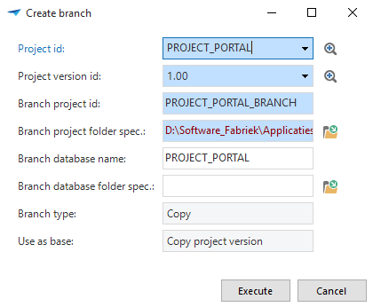
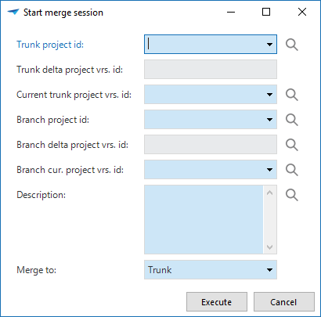
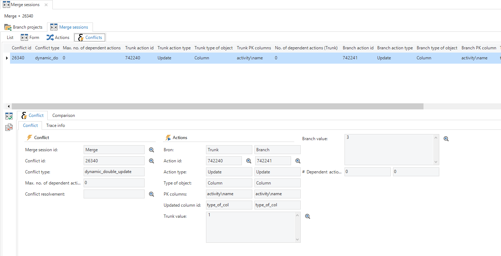
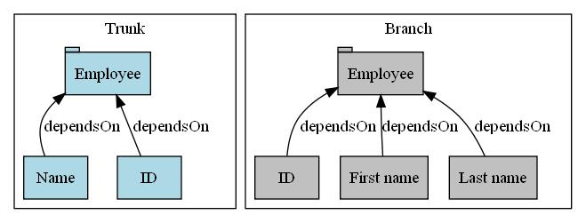
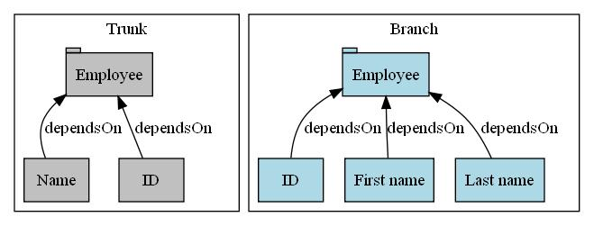
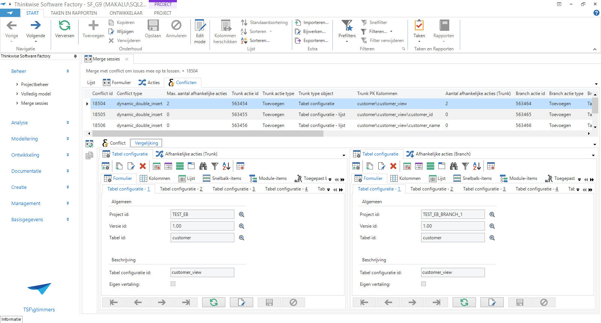

When several developers or teams work on different components of an application, then branches of a project version can be made for these components via the branch projects screen. Each component can be further developed separately and as soon as a component is completed it can be combined again (merged) with the main project (trunk) via the Merge Sessions screen In this way a new component can be developed and tested entirely in separation from the rest of the project.

### Creating a branch

A branch is a new project and just as with other projects can be separately started. A branch can be created in the *Branch projects* screen under *Branching and merging* with the help of the task *Create Branch...*. This task opens the following popup.

*Popup for creating a branch*

Firstly it must be indicated for which project and project version a branch must be created. The name of the branch project can then be entered and a location selected for the project and the database.

When the branch is created it can be developed further. To do this select the correct project and the associated project version on the project screen.

### Merging

As soon as the branch project is satisfactorily completed and tested, it can be combined again with the trunk or another branch project. This can be done in the *Merge sessions* screen under *Branching and merging*. A merge can be started with the help of the *Start merge session…* task.

*Pop-up for starting a Merge session*

It is indicated which branch project needs to be merged with which project. Any conflicts are identified so that a solution strategy can be defined in the following step. In this situation only a comparison is made. Because no modifications have yet taken place the user can always go back to the previous step. Only when all conflicts have been resolved, see the following paragraphs, can the  *Execute merge session* task be started to carry out the merge session.

**Tip**

After starting the merge session set the associated branch project version to inactive. Modifications to the branch version will no longer be included in that merge session.

If it is necessary to still make modifications in the branch project version, then a new session must be executed.

It is also possible to merge modifications from the trunk into a branch. It can then first be tested whether the new version works correctly, before the trunk is updated.

When a branch is merged with the trunk, then the generated objects of this trunk will not be deleted. It is therefore not necessary to regenerate the trunk version again following the merge.

#### 

#### 

#### Base versions

When creating a branch a base project version is automatically created. This base version is henceforth prefixed with the project version of the trunk. E.g. *1.10\_BASE* to indicate on the basis of which version it has been created.

#### Active merge sessions

Merge sessions have been given a *Completed* check mark. As long as a merge session is not completed, the indication *merging* will be added to the project version, to indicate that a merge session is running. Modifications in a project version with the status merging may be lost when the merge session is carried out.

*'Merging' indicator with project version*

### Conflicts

Conflicts are presented in the *Conflicts* tab. When the merge session is started three kinds of conflicts can occur.

- Static conflicts

Static conflicts only occur when the branch is started with an empty project or a (sub) application and an object is created in the branch which already exists in the trunk.

- Dynamic direct conflicts

This type of conflict occurs when there is a double insert or update or when on the one hand a delete and on the other hand an update is carried out, such as deleting a table compared to adding columns to this table.

- Dynamic indirect conflicts

This type of conflict occurs if a delete in the trunk and an insert or update in the branch takes place at the reference level.

*Overview of the 'Conflicts' screen with the 'Merge Sessions**

#### Resolve conflicts

After the conflicts are detected they can be resolved one by one. It is also possible to resolve several conflicts simultaneously with the help of the task  *Resolve conflict …*. This enables the modifications from the branch or from the trunk to be carried out. There are four options available:

1.  Only carry out the trunk action: Only the parent and children of the trunk are included.

2.  Only carry out the branch action: Only the parent and children of the branch are included.

3.  Carry out trunk actions with dependent branch actions: The parent and children of the trunk plus the children of the branch are included.

4.  Carry out branch actions with dependent trunk actions: The parent and children of the branch plus the children of the branch are included.

> 

**NOTE**

Options 3 and 4 can lead to new conflicts between the children of the trunk and the branch. These will then have to be resolved.

With the task *Compare code* it is possible to compare and merge the different values of a column for the conflicts *Dual change* and *Dual addition* with an external comparison table (WinMerge or KDiff3). After saving the file in the comparison tool the merged text is transferred in the pop-up. By clicking on *OK* the value is stored with the branch and the processing set to *Only carry out branch*.

*A conflict comparison during a merge session*
