To be able to develop an end product a work project is first created. Further development of a project takes place by first creating a new version of the project by making a copy of the current version and then modifying or expanding the new version. The end product can be automatically transferred to the new version by producing a difference analysis between the two versions and carrying out the upgrade on the basis of this.

To create a project click on the "Add" button in the ribbon on the Project Maintenance screen. The following screen then appears:

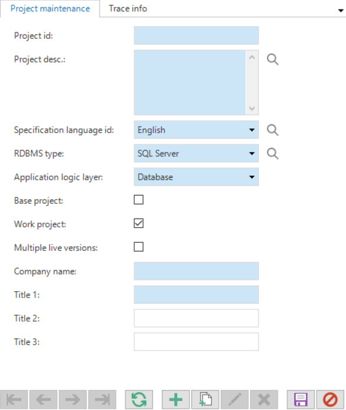

*Creating a new project in the 'Project Maintenance ' screen*

As shown in the above figure input fields can be marked blue or white. Blue fields are required fields and white fields are optional fields. Grey fields cannot be modified by hand.

The following data needs to be provided to create a project. This also determines a number of things with regard to the start of a project and the end product to be developed.

- A project id and a project definition are specified for identification.

- The language is specified for the requirements and the application logic.

- A choice has to be made for an RDBMS[3] (database platform).

- The application logic layer determines where the application logic is stored and in which programming language this takes place. In fact this determines the architecture of the application. A choice can be made from two forms, with the functionality on the database, or a structure for which the functionality is on a middle tier.

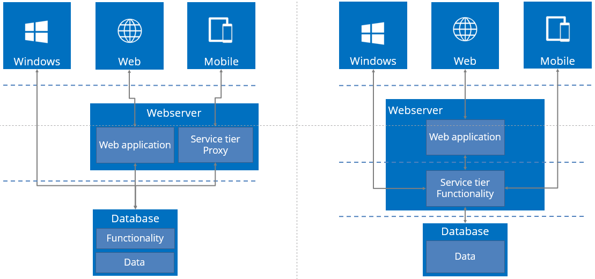

*The architecture diagram for a presentation of the two possibilities*

> With a Database application logic layer the programming language is connected with the choice for the RDBMS. If a middle tier is chosen than the application logic will be written in C\# or Java.

- It must now be indicated whether the project to be developed is a base project. The concept of base project is explained in more detail later in this chapter.

When the project is added, a popup appears to create the first project version.

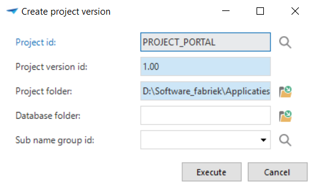

*Popup for creating a project version*

Files are also necessary within a project version, for instance, for reports and icons. These files are stored for each project version in a folder structure within the Project folder.

Entering a sub-project name is optional when creating a new project. If this not entered, then a sub-name group is created automatically with the name of the project. A sub-name group contains all terms used in a model and is intended to keep the spelling and syntax of these terms consistent. Company own sub-names can be added. Other projects can then refer to this project, so that these translations do not have to be approved again for another project. This is explained further in chapter 12.1.

### Project version

The different versions belonging to a project are stored under project versions. In addition, it is possible to specify a number of specific things including the various application languages, platforms, linked base projects etc. These components are briefly explained in the following paragraphs.

#### Service tier

A service tier can make a connection with the database via the current user or via a central account. When use is made of a central account, so-called pooling, then pool user and pool password offer the possibility to store the account details.

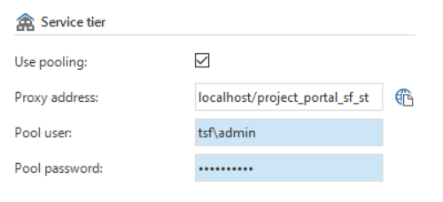

*Screen shot from the 'Full model' tab where the service tier details are entered*

*IAM Service tier*

A service tier can authorize the users via IAM. The server, database and RDBMS of the IAM database must be provided for this. The connection between the service tier can be made with pooling by one central account.

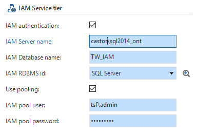

*Complete the IAM Service tier*

##### Proxy generation

As is shown in the architecture diagram (

*The architecture diagram for a presentation of the two possibilities), it is possible to store the logic in the database and then create a proxy for Mobile, so that the logic can be used by Mobile. The proxy is only used here as *conduit* for the logic.*

The selected RDBMS and application logic layer determine which base projects (see paragraph *Base projects*) are linked in as standard. When a database application logic layer is selected then a service tier base project (C\# or Java) can be linked in by hand. In that case a service tier proxy that makes use of the logic in the database is generated automatically. It is then not necessary to develop the business logic in the service tier.

Proxy-services are only generated for objects that are also actually accessible by Mobile. This ensures that the generation of a large application is not influenced more than is necessary when only a few objects are accessed by the Mobile GUI. Furthermore this improves the start up speed and the memory usage of the proxy service layer.

Manually defined services and service operations are always generated, separate from the presence of Mobile. In this way it is easy to generate an own C\# or Java SOAP interface for the application from the Software Factory, without a separate project version being necessary for this.

#### Status

To allow a project to run in a structured manner a separation is made in the Thinkwise Software Factory between the various phases in the development process using the Thinkwise Software Factory. These phases with the associated statuses are shown below.

|Development||
|--- |--- |
||Analysis|
||Data model|
||GUI model|
||Programming|
|Test||
|Acceptance||
|Production||
|Inactive||
|Cancelled||

Table 1: Overview of development phases

This status is displayed in the status field on the project version screen. A status can always be changed. It is however advisable to keep to the order as shown in the above illustration, so that the project runs as structured as possible. The status of a project version can be changed in the Project Maintenance screen.

##### Development

The status *Development* ensures that all components of the Software Factory can be accessed. This status is particular used by projects that are carried out by one developer because, by definition, you cannot get in each other's way. To be able to work as structured as possible during the development process the choice can be made to use the statuses as described in this paragraph.

- Analysis

> A project starts with an analysis of the requirements for the system to be developed. This takes place during the analysis phase.

- Data modeling

> When a new project version is started, a start is made with setting up the data model for this project version. The status of the project version is now set to *Data modeling*.

- GUI modeling

> As soon as the data model is complete, this is *frozen* and a start can be made with modeling the GUI. The status now needs to be set to GUI modeling. The entire user interface, including tasks, reports, business intelligence and the process flows can now be set up.

- Programming

> The last step to complete the development phase is the addition of specific functionality. The status is now set to *Programming*.

##### Test

When the development phase is completed, the end product can be tested. The model may no longer be modified once this phase has started.

##### Acceptance

During the acceptance phase the users can become acquainted with the system and detect any last errors.

##### Production

When the system is accepted, then it is put into production. The project version can no longer be modified once it is put into production. To do this a new version must first be created.

##### Cancelled

This status is used for a version that was never taken into production. For example, because use was made of a newer version.

##### Inactive

> This status is used for a version that has been in production and is now replaced by a newer version.

Runtime configuration

Starting from G9.8 it is no longer necessary to enter the connection details of the end product in the ini-file. Instead of this a *Runtime configuration* is set up in the model and this is provided as ini-parameter. This is done as preparation for the official inclusion of the ini-parameters in the Software Factory metamodel.

An extra *Runtime configuration* tab has been added under project management, with project versions.

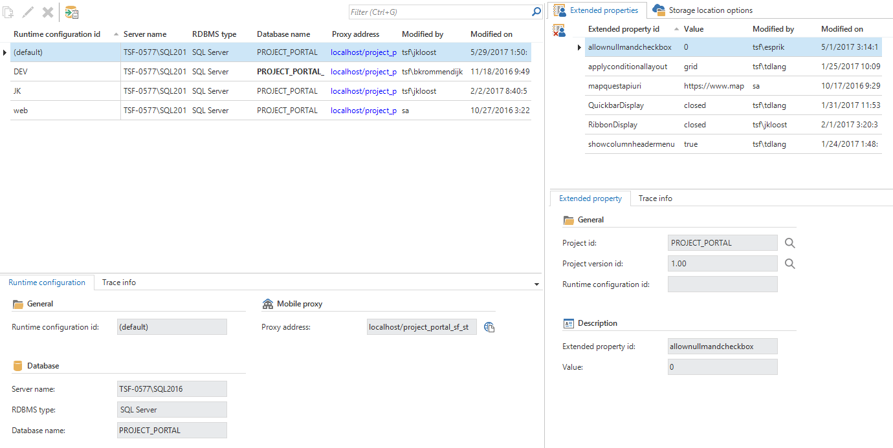

*Runtime configuration*

The old ini-parameters are still supported in G9.8, for which a warning is given. The use of the runtime configuration will be compulsory in the next version of the Software Factory.

Existing ini files can be converted with the task *Convert ini file*. This task can be found under *Runtime configuration* and in the menu under master data. The task will read in the ini-file and add the settings in the SF. Afterwards this task will remove the parameters from the ini-file and add the parameter *RuntimeConfiguration*.

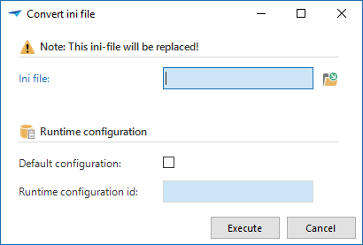

*Convert Ini file task*

There is always one default configuration, containing the settings that have been entered with the project version. The other configurations as a default will take over the values and ini-parameters from this default, unless a modification is consciously made.

### Storage locations

Currently, there are four main storage types available in the Software Factory. Each type has unique properties to set up the configuration.

- Azure – In the cloud

- Database – As binary data in the designated column in the application database (BLOB or SQL Server FileStream)

- FTP – File Transfer Protocol

- File system – On the file system

*Storage locations*

For all storage types, except database, it is possible to add subfolders on individual columns, see the next figure. The storage location itself is specified in the Domain. Thus, a column will have the main storage location from its Domain, but files can be stored in a subfolder by setting the subfolder field inside the column properties.

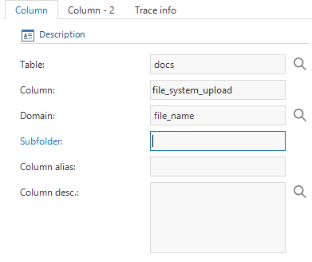

*Subfolder field in column properties*

Storage locations can be set on Domains which use one of the following controls File Link, File Upload, Folder Link, Image Link, Image Upload or Signature.

#### Azure

Azure file storage will work with the Microsoft Azure*s file storage system, this has the same structure as any file system. Therefore, Azure allows for a nested folder hierarchy i.e.

https://storageaccount.file.core.windows.net/files/image/image.png.

A storage account need to be setup first for Azure file storage to work properly. First login to <https://portal.azure.com> then select the *Storage Account* service and add or use an existing storage account. To find the login settings to be used in the Software Factory, click the storage account and inside click on *Access Keys*. The *storage account name* and *key 1* values need to be set within the Software Factory as *username* and *password* respectively as shown in next figure.

*Azure Storage Location settings*

#### Database 

Database storage will store the bytes directly in a storage column on the database. The field to select the storage column becomes visible when a column is set to have a database storage location. The storage column needs to be a column with the VARBINARY_MAX datatype.

Take into account that Filestream storage only available is when using a SQL server database. To use filestream storage, the storage column will need the datatype FILESTREAM. In addition, the database requires a table with a filestream column to have a ROWGUID column as well.

#### Filestorage

The path property can either be a network location or a drive. Be aware that it must be a full (rooted) path. I.e. \\\\networklocation\\files\\ or C:\\files\\.

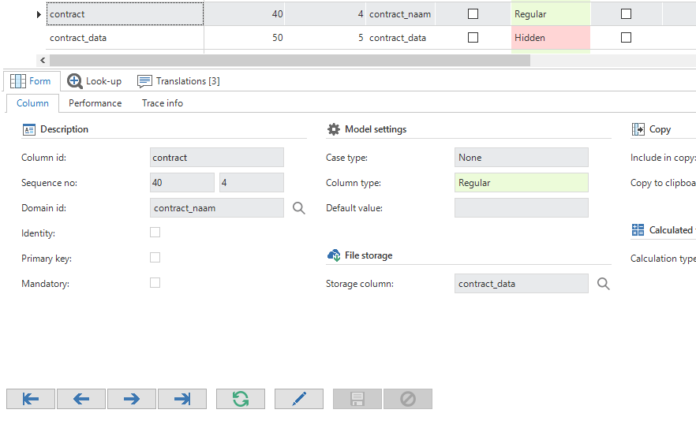

*File upload with data column*

#### FTP

For FTP storage fill in the *username* and *password* with a user that has write access to the ftp server. The Server name field should be filled in with the server address to the ftp. Notice that opposed to Filesystem storage the Path property must be relative from the server address. For example, Servername = ftp://office.thinkwisesoftware.com/ and Path = /files/.

The configuration can differ for each application and application state by linking it to the runtime configuration.

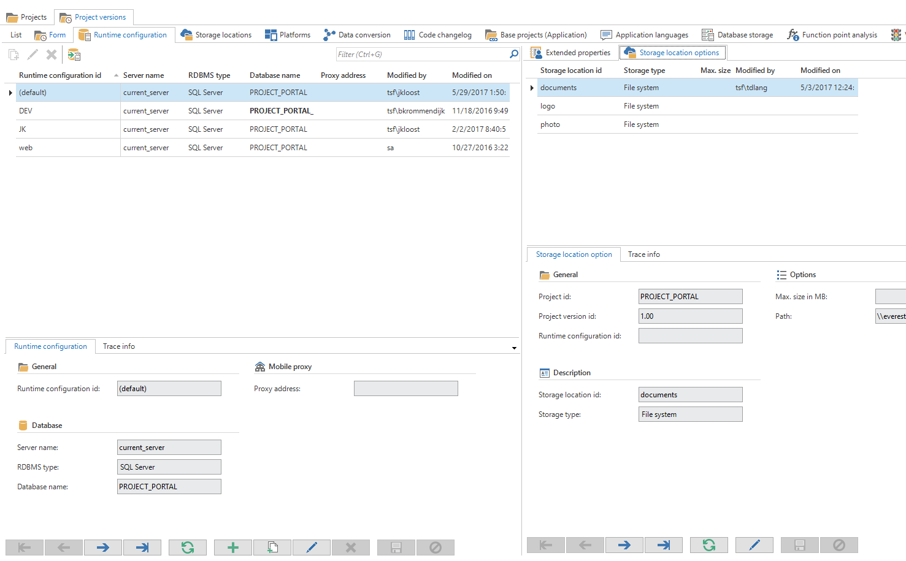

*Runtime configuration*

### Platforms

It can be indicated here which platforms are available to start the project in (Windows, Web and/or Mobile).

### Data conversion

When the current version of the end product is fully operational and a modification must take place in the data model, then this can best be done by means of an upgrade with version control. In this way the entered data of the operational version is also automatically transferred to the new version.

An upgrade with version control contains the following steps:

- Copying the existing project version to the new version

- Extending the new version with required (data) model additions / modifications

- Upgrading the end product database to the new version

#### Copying the project version

To copy a project version, the current version must be copied to the new version in the project version screen with the task *Copy project version* in the context menu. The new version is now exactly the same as the old version.

Give the old project version the status *In production*. This is the meta level that normally speaking controls the production environment, while development continues in the new version.

The old version is now no longer displayed because production versions fall outside the prefilter. Of course, production versions may not be modified anymore.

The new version automatically gets the status *Development*.

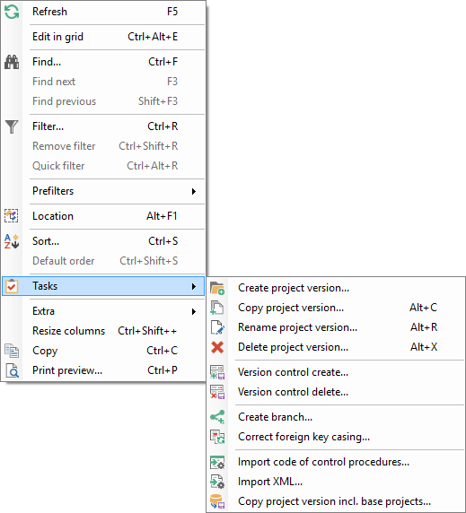

*'Right mouse button click' gives access to the overview of, for example, tasks*

During copying the project id and version id are replaced by the new project and version in file references to, for instance, icons and reports in the model. Do not forget to copy the old project version folder to the folder of the new version.

### Base projects

It is possible to indicate whether a project is a base project. This is a project which will be used in several other projects. The base project contains certain details that are necessary for the correct operation of a project, a supplement or an addition, such as a standard layout or a requirements model. When this check mark is checked it is possible to opt for immediate copying, this ensures that the data in the base project is immediately copied to a new work project. Furthermore, it can be indicated whether the base project must be linked as standard in all new projects.

Bear in mind that only base projects with the status *In production* are copied.

An existing base project that is not copied as standard, can be manually added to a project version.

To make the addition permanent the definition must (again) be defined by checking the *Copy base projects* check mark. The base project that is added, is then copied to the current project version.

### Application languages

It is indicated here which application languages are available to start up the GUI in. Dutch, English and German are included as standard languages. Other languages can be added manually by the developer. This is done by adding a language and then translating all GUI items under the translations tab.

### Tags

Tags appear in various components of the Software Factory, for example, with tables, tasks and reports.

A tag is a freely definable property that can be linked to rows of a table and can be provided with a value. Tags can be used to provide control for control procedures if the required information is missing, as standard, in the Software Factory.

*Overview of the 'Tags' tab on the 'Full model' screen*

Self-defined tags and their intended use can be registered in the Thinkwise Community Portal, so that they can be formally included a following version.

