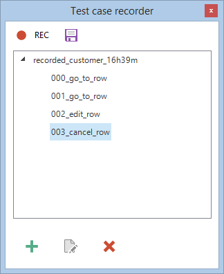
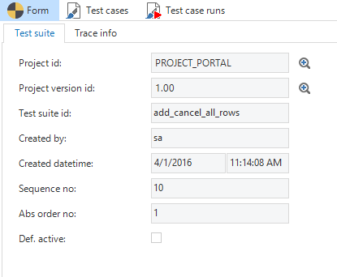
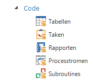
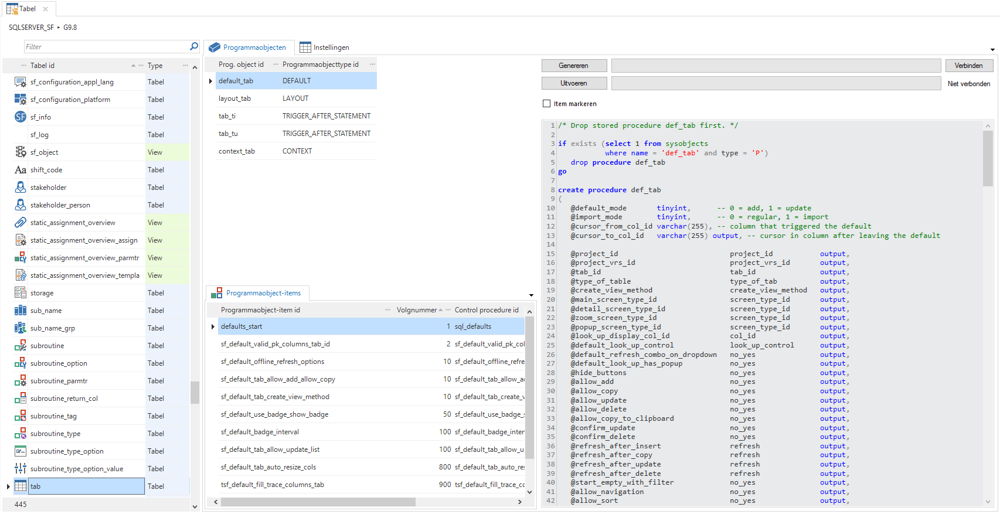
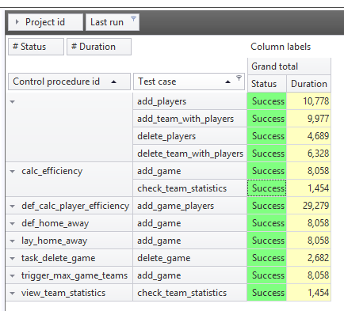

Thinkwise tests to be able to guarantee the quality of the delivered product. Why is this recorded in the Software Factory and is no use made of standard test tooling? Thinkwise's agile, model-driven development method in combination with the abstract user interfaces makes testing Software Factory applications with traditional Point & Click test tooling inefficient and laborious. By completely including test cases in the Software Factory model and executing them by the run-time layer (now GUI, later Indicium) these test cases will continue to work correctly after modifications in both the data model and the GUI model. Automatic test cases can also be generated on the basis of the model.

The objective of the integrated test automation is to test the business logic; all program code in SQL, Java or C\# that is added by the developer. These are templates but, for example, also prefilter queries, view definitions and calculated fields. Automated testing is not intended for automating acceptance tests. Acceptance tests are intended to obtain commitment from the users; this cannot be achieved without allowing the user himself to operate the application. Any findings from acceptance tests, if possible, should of course be processed into the test cases.

### Procedure

Test cases are drawn up by the developer on the basis of the requirements and/or design. This is an iterative process; each time that functionality is added or modified test cases need to be drawn up and if errors are found the test cases need to be extended or amended.

There are two test approaches possible:

  - Draw up test cases prior to development of the business logic (Test Driven Development). This forces the developer to very carefully consider the desired functionality before he starts programming.

  - Drawing up test cases after programming, preferably by a different person than the one who wrote the code. Possible borderline cases or error situations can be identified on the basis of the code.

Pay attention that when drawing up test cases it is not only the happy flow that is tested, but also the exceptions and borderline cases. For any findings the test cases need to be extended or amended, to guarantee that this error does not return through modifications to (other) functionality.

### Set up

Test cases are linked to control procedures, for which it is possible to link several test cases to the same control procedure, for example to test the unhappy flow or with other business parameters. Furthermore separate test cases can also be made for the preparation or cleaning of data.

By grouping test cases in a test suite for each process/module it can quickly be made transparent whether a process/module works correctly and whether a process is completely covered by test cases. Furthermore, in this way use can be made in test cases of data that was created in previous test cases within the process. Independent test cases can be grouped in a separate collection test suite.

**Test suites**

Test cases can be grouped into a test suite. In this way a distinction can be made between groups of test cases that need to be executed simultaneously. For example a test suite with all test cases and a suite with only new test cases in this version.

**Tip**

It is advisable to first create Test Cases and to later group these in Test Suites.

### Creating Test Cases

#### Recording Test Cases

Test cases can be easily created by recording the tests in the end product. The recording of user actions is done in the end product in the developer mode. The *Test case recorder* button is in the ribbon, in the *Developer* tab. The recording screen can be opened with this button.

Recordings can be started and stopped by pressing the *REC* button. A recording always starts with opening a screen, task or report from the menu. Various steps can subsequently be performed on this object. These steps are recorded and stored in the recorder. Manual checks can subsequently be added. This is done by selecting a test step and pressing the 'Add' button.

When the test is complete, it can be stored, so that it can be fed back to the Software Factory.

#### Creating test cases manually.

When creating a test case you have to enter a test case id. For example, if the test case adds a customer, then 'add\_customer" would be a logical name.

The sequence number which is entered for the test case is relative in all test cases, that are not in a test suite. A distinction is made later in the use interface between individual test cases and test cases in a test suite.

The last thing to be entered is a report id, table id, task id or a custom screen id and possibly a variant. This entity is the starting point for the test case. When playing the test case, the user interface will automatically open the table, report, task or custom screen, even if no further test steps have been added. The default active checkmark can be enabled if it is required that the test case be automatically enabled to be executed in the user interface.

Figure 220: Creating a test case

*Test step*

A number of test steps can be carried out for each test case. Test steps represent user actions in the user interface.

When selecting an action, a number of fields that are required for this action, will become available. If the input values are optional and are left empty, the user interface will enter an empty value.

Figure 221: Adding test steps

##### Exceptions

The following input values can be selected for the user action *Modify report export type* : PDF, RTF, PRINT or PRINTPREVIEW.

A § (paragraph) separated input value can be entered for the user action *Go to row*. The paragraph sign serves as a separator to specify a composite primary key. For example: 10§2

All entered queries are executed scalar. This means that the query only returns the value of the first cell of the first row. In the queries you can make use of square brackets \[...\] containing the id of the column. In this way the value of the column in the active row can be included in the query,

**Example**

*  
*

*Test step check*

When a test step is performed, it is possible to carry out checks in the user interface. These checks can be used to verify whether the handwritten functionality has had the desired effect on the data or workflow of the application.

The checks can be divided into two categories: availability checks and value checks. With availability checks certain components within the user interface become visible and accessible to the user. Examples are the properties of columns (normal, read only, hidden, optional and mandatory), tabs, reports, tasks, and the buttons in the form and ribbon.

With value checks, you can check whether columns have the expected values. This can be checked with static values, but also with SQL queries.

For the control type Message, the expected type of message can be specified as the control value. The message type can be specified by selecting one of the following values:

  - 0 - Error

  - 1 - Warning

  - 2 - Info

  - 3 - Question

#### Generate test cases

Apart from manually entering and recording test cases, test cases can also be generated automatically. By adding the basic project DEFAULT\_TESTCASES to the project, a number of test cases are already generated as default, including:

  - Add and cancel rows; in each table with defaults or layouts, add and cancel is pressed. The defaults and layouts are executed and superficial errors are immediately identified.

  - Details; runs through all the detail tabs in the user interface, so that all the context procedures are executed.

  - Reports; opens and closes all the reports, which checks if all the reports are available.

<!-- end list -->

  - Tables; opens and closes all tables, which executes all the layouts and it can, for example, be checked whether all the views are working.

  - Tasks; opens and closes all the tasks, which checks if all the tasks are available.

  - Toggle prefilters; enables and disables all prefilters, making it possible to check whether the custom prefilters are working correctly.

### Perform test cases

Just as with recording, the end product should be started in developer mode. The test console is then available in the Developer tab. The test console contains the test cases that have been created in the Software Factory. In the left section it is possible to select the test suites and/or test cases that have to be executed.

The GUI tries to execute test cases as fast as possible. However, this can no longer be followed by eye. It is therefore possible to follow the waiting times between the steps via the test console settings. In this way, the tester can monitor the progress of the test. Additionally, you can indicate which messages should be captured. The test results are fed back by default to the Software Factory; this can be disabled manually.

Figure 222: Overview of the test cases with the underlying test steps

**Note**

During the execution of the test the user should have no interaction with the end product, as this may interfere with the testing process.

### Code

Using the option in the *Code* menu group all logic concepts (defaults, layouts, triggers, etc.) of tables, tasks, reports, process flows and subroutines can be retrieved.

It is also possible to generate code groups and re-execute the program objects. The shortcut for generating code groups has been adjusted to Ctrl + Alt + G and can be used from all screens of the functionality screen. This feature replaces the task for generating and executing code under Subjects.

Figure 223: Code menu

With these new screens it is possible, for instance, that:

  - The template that is woven in a specific concept is quickly recovered;

  - The complete code of a specific concept is read through;

  - The code of all concepts of a specific object are executed again.

Figure 224: Table of program objects

### Data

The use of a *dedicated* test database presents all kinds of problems with, for example, time dependent data, upgrades and the development in several branches. It is also not realistic to add all the required data for the tests by means of test cases/steps.

The assumption is therefore that it must be possible to use every production database as a test database. Static (master) data already exists in that case. Other details need to be created during the testing, possibly in separate test cases (with “Query” test steps).

It must also be possible to execute test cases several times on the same database. It may therefore be necessary to delete or restore added or modified data.

If use is made of business parameters that effect the functionality of the application the choice can be made to test against several databases or to set up (and re-set) the parameters by means of test steps.

### View results

In the Software Factory, the results of the execution of one or more test cases can be analyzed under test runs. The status is shown for each component, so that you can quickly identify where the test cases have failed.

Furthermore, the test coverage analysis and the test run analysis can be used to gain more insight into the testing. For example it is possible to analyze which test cases have been executed, the duration of the runs and what the results of the test cases were.

Figure 225: Overview of the test run results
