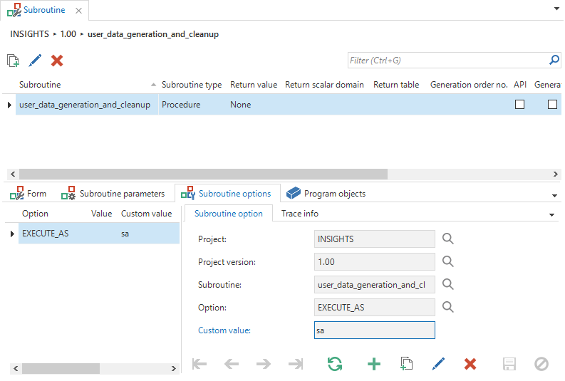

Business logic that is not used directly by the user interfaces but is only called by other business logic or made available via the OData API can be created using *Subroutines*.

Subroutines are used to define business logic that is not used directly by the user interface but is only called by other business logic or, through the OData API, by third party applications. Subroutines can be, for instance, functions, stored procedures or services.

Different types of subroutines are available, depending on the application platform.

|Type|Description|Platform|Can be an API|
|--- |--- |--- |--- |
|CLR procedure|Common Language Runtime|SQL Server|No|
|DLL assembly|Assembly Library|SQL Server|No|
|Function|SQL function|SQL|Yes|
|Operation|WebService|Java/C#|Always|
|Procedure|SQL stored procedure|SQL|Yes|
|Static method|Static method|Java/C#|No|

Depending on the selected subroutine, the following result values can be specified:

- None

- Scalar - The result is a single value. If you select this, the column *Return scalar domain* is displayed. A domain can be selected that determines the characteristics of the result value.

- Table - The result is a table containing multiple rows. If this option is selected, then in the *Subroutine return columns* tab, the columns can be named. This will be displayed as the result in the table. These columns also refer to a domain.

The result values are not applicable for every program object.

Virtually every subroutine type has input parameters. These input parameters can be provided in the *Subroutine parameters* tab.

## API

Subroutines are generally used internally by the application and will not be accessible directly using Indicium. If a function or procedure has to be called by an external caller using Indicium, it can be marked as an API. Indicium will expose the procedure or function as a web service.

Operation-typed subroutines are always exposed as web services, not through Indicium but through a generated Java or C# SOAP service tier.

## Atomic transaction

One of the settings you can change is to run a procedure-based subroutine as an atomic transaction.

When the stored procedure uses a transaction, the data changes of each individual statement will be definitive once all statements within the task have ran succesfully. Error that occurs will cause the data changes by earlier statements to be rolled back. 
If the stored procedure using a transaction is called by another caller (a trigger or another stored procedure) using a transaction, the data changes will be definitive once the caller finishes the transaction. However, rolling back the transaction at any point will cause all of the nested transactions to be rolled back.

When a stored procedure doesn't run in a transaction, data changes by each individual statement within the stored procedure code are definitive the moment the individual statement has been executed (unless the caller opens a transaction).

Not running a transaction is generally more performant since the database engine doesn't have to keep track of the data changes while the transaction is active. The data that's being tracked can also cause deadlocks as other transactions can be waiting to use this data. However, not running in a transaction can cause data corruption depending on the way the code is written.

It's always possible to start and complete transactions manually in code. Using this setting provides a generic solution with nested transaction support and proper error handling.

## Subroutine options

Depending on the type of subroutine and the platform of the subroutine, various options are available to change the behaviour of the subroutine.

*A procedure on SQL Server using a subroutine option to always execute as a system administrator*