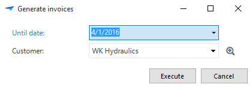
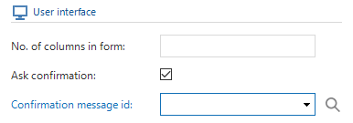
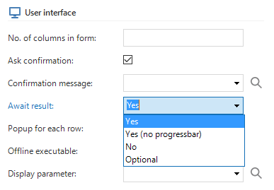
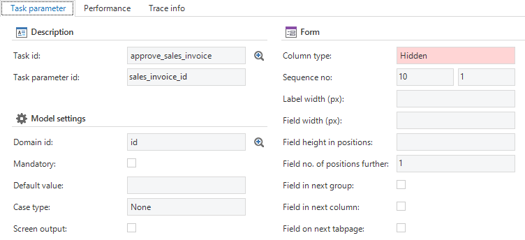

A task represents business logic that can be executed manually by the user. A task can be linked to one or more tables and will be displayed in the ribbon, the context menu and possibly in the task bar. Columns of the table can be linked to the parameters of the task. The values of the linked columns of the active record are then passed on to the relevant parameters.


*An example task pop-up*

In addition, a reference can be established from a parameter to a look-up table. In this way, a parameter gets a drop-down list and a button in order to be able to select another value in the pop-up.

A task has a default and a layout mechanism, just as a table. A shortcut combination can also be defined with which the task can be started using the keyboard.

## Creating a task

When creating a new task, you have to select the type of task to be created. The following types are supported in the Software Factory:

- Template
- Windows command
- GUI code
- None

#### Template

This is the default value, which creates a stored procedure on the database.

#### Windows command

Tasks can be used to call an external program or to open a network or web address. The location of the external program, the network or web address have to be entered in the *Object name* field. Any parameters that are added to the task will be passed on to the call of the external program. However, this only works with external programs and not with network or web addresses.

To start Paint for example, enter the program name *mspaint.exe* in the object name and add a *filename* parameter to open that file.

Or create your own batch file to print a PDF document:

```
@CALL START /MIN AcroRd32.exe /N /T %1
```

With the use of parameters, it is also possible to create dynamic external program tasks. This can be used in situations in which the external program, network or web address to be opened is not always the same but changes depending on the situation. In these cases, a parameter has to be added to the task with the location of the external program, network or web address. The *task parameter ID* of this parameter has to subsequently be specified between square brackets in the *Object name* field of the task (e.g., [URL]). For dynamic external program tasks, all other parameters are ignored.

To open a dynamic URL without knowing the default browser, you can trick the task by using 'http:' as Object name and set the first parameter to the URL to be opened. The same goes for other URI schemes like 'mailto:'.

#### GUI code

This options allows *custom C\# tasks*, such as the TSFReportMailer, to be linked in. The name of the custom task should be entered in the *Object ID* field.

#### None

Represents a dummy task which can be used in a process flow or to display a form.

### Task confirmation

If *Ask confirmation* is checked, a [message](messages#message-options) can be selected that is displayed before executing the task. The task is executed when a message option with a status code of zero or higher is chosen.


*Task with confirmation message*

### Progress

When performing long-running tasks or tasks in combination with multi-selection, a progress dialogue is displayed. In addition, the progress percentage can also be displayed from (SQL Server) stored procedures while a procedure is being executed.


*Progress Percentage of executing a task*

To display the percentage, the procedure 'tsf_send_progress' should be called from the SQL code:

tsf_send_progress *[message id], [parameterstring], [percentage]*

##### Message ID

Optional parameter with which text above the progress bar (default *Run task...*) can be changed by the translation of a message_id.

##### Parameter string

Optional parameter with which parameters in the translation can be filled when use is made of a specific message_id. It is also possible to use translations of model objects, such as columns or tables. For more information, see paragraph 8.2.

For example, for SQL Server:

> exec tsf_send_progress 'copy_customer', '\<text\>Thinkwise\</text\>', 82;

##### Percentage

The progress in percentages. By setting the percentage to *-1*, the progress bar remains in the marquee position.

### Await result

Tasks can take a long time to process. There are four options to give instructions about what to do with these tasks.


*Task with await result options*

1.  Yes - The user has to wait for the result and a progress indicator is shown.
2.  Yes (no progress indicator) - The user has to wait for the result (the GUI freezes and hourglass is shown).
3.  No - The action is executed in the background and the user can continue working.[12]
4.  Optional - The user has to wait (option 1) but has the possibility to continue the action in the background (option 3).<sup>1</sup> Reports executed in the background could be monitored in a new “Async action” dialog.

For Web, this means that the long-term actions no longer cause a request timeout from IIS. (Default after 90 seconds)

The display parameter can be used to distinguish between multiple instances of a task in the async action dialog.

### Atomic transaction

Template-based tasks can be set to run as an atomic transaction. See [Subroutine - Atomic transaction](subroutines#atomic-transaction) for more info.

## Task parameters

After creating a task, parameters can be added to the task that define the input values for the task. Parameters are in a specific sequence and are linked to a domain for the data type and the control.


*Parameter settings when creating a task*

Task parameters can be formatted in the same way as forms of tables are formatted. Column type, sequence number, label width, field width, field height, number of positions further, field in next group, field in next column and field in next tab are available for this. 



*Task parameter settings*

## Look-ups

By specifying a task reference (between task and table and corresponding column comparison), it can be determined in which table the value for a field should be looked-up and entered.

## Conditional formatting

Just as with columns, the task parameters can be given a background color or a different font. Since a task does not have a grid, this will only be applied to form parameters.

## Table tasks

A task can be linked to one or more tables. In these tables, the task will be displayed in the ribbon, the context menu and possibly the task bar. Columns in the table can also be linked to parameters of the task. The value of the field of the active record is passed on to the parameter as a default value.

### Grouping of tasks

Tasks within a table can be grouped together to display them logically. Both the groups and the tasks within a group can be put in a sequence. When tasks are grouped, they can be displayed in two ways in the context menu:

- Through a sub-menu

- Separated by separators

## Menu

A task can be included in several menus. If a task is linked to a table, it will appear in the ribbon and the context menu of this table. A task can also be included in the quick launch bar, a tree view or a tiles menu. In this way, the user can immediately start the task without first having to open a screen.


## Functionality

When generating, a program object is created for template-typed tasks. The associated default and layout program objects are also created. The application logic can be modelled and described in the [Functionality screen](functionality). 

## Variants

Using task variants, it is possible to design alternative user interface views of a task. A task variant can, for example, have a different icon and translation, default values and conditional formatting than the default. More information on variants [here](variants).

