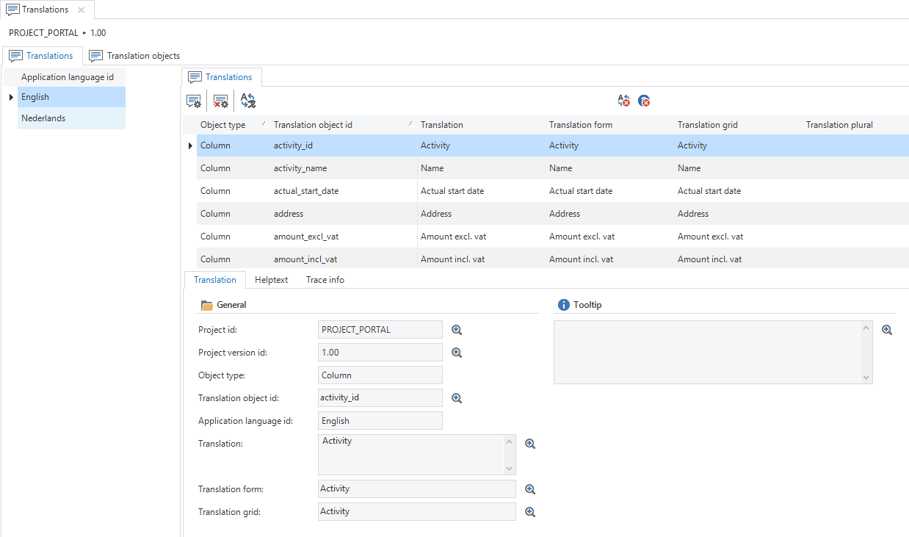

All strings that are used in the user interfaces can be translated, such as labels, buttons, tables and columns. For every translatable string, a *translation object* is generated for which a translation can be entered in the *Translations* screen or the *Translation* tab page found in many other screens.

To manually generate translation objects for new objects, execute the *Generate translation objects* task.

*Translations screen*

A translation can be specified for each application language defined for the project. Additional languages can be added using the [Advanced menu](advanced#model). The user interface can therefore be provided in any language or dialect. Of course, Unicode is fully supported, which means that languages such as Polish, Frisian or Chinese are all possible.

>  When an additional language is added, all the GUI objects have to be translated along with the own objects, too.

An object contains, at most, the following translations, depending on the type of translation object:

- (Single) translation
- Translation form
- Translation grid
- Plural translation
- Tooltip text, shown when the mouse is moved over a field name, group name, tab or column. It is possible to use HTML to format the text.
- [Help text](help)

Untranslated objects can be translated semi-automatically with the *Translate untranslated objects* task. The task replaces underscores with spaces, removes the square brackets and changes the first letter to a capital letter. It is convenient to generate translations for the language in which the data model was written.

## Link tables

With link tables that are displayed as detail, it is often desirable, depending on the context, to display another translation. This is possible by including the plural translations of both master subjects, separated by a forward slash (*/*), in the plural translation of the linking table. The GUI will show the part of the translation that is not equal to that of the current master table.

For example, by giving the linked table between *person* and *company* the translation *Persons/Companies*, the table will have the translation *Companies* under *person* and *Persons* under *company*.